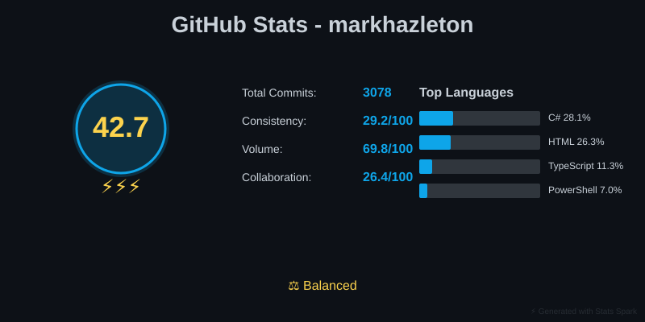
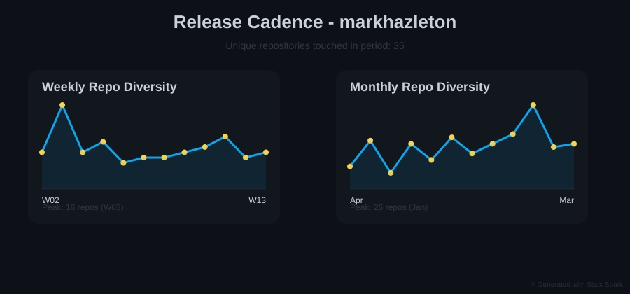

# Stats Spark ⚡

> Automated GitHub profile statistics generator with beautiful SVG visualizations and AI-powered repository analysis

[](https://opensource.org/licenses/MIT)
[](https://www.python.org/downloads/)

**📊 [View Sample Analysis Report](output/reports/markhazleton-analysis.md)** - See real-world output with AI-powered insights
**🎨 [View Interactive Dashboard](https://markhazleton.github.io/github-stats-spark/)** - Explore repositories with live visualizations

---

## 🎯 What is Stats Spark?

Stats Spark is a comprehensive GitHub analytics suite that transforms your GitHub activity into actionable insights and stunning visualizations. It combines automated SVG generation for profile statistics with AI-powered repository analysis to give you a complete picture of your development work.

**Perfect for:**

- 👨‍💻 Developers wanting to showcase their GitHub activity professionally
- 📊 Teams analyzing repository health and contribution patterns
- 🎯 Technical leaders reviewing developer productivity and technology usage
- 🚀 Open source maintainers tracking project momentum and community engagement

## 🌟 Why Stats Spark?

### Beautiful Profile Statistics

- **Automated Daily Updates**: GitHub Actions workflow runs at midnight UTC
- **5 Visual Categories**: Overview, heatmap, languages, streaks, and fun stats
- **Unique Spark Score**: 0-100 metric combining consistency, volume, and collaboration
- **Theme Customization**: Dark, light, and custom themes with WCAG AA accessibility
- **Zero Maintenance**: Set it once, updates automatically forever

### AI-Powered Analysis

- **Intelligent Repository Ranking**: Composite algorithm weighing popularity, activity, and health
- **AI-Generated Summaries**: Claude Haiku creates technical summaries with 97%+ success rate
- **Developer Profiling**: Technology diversity, activity patterns, contribution classification
- **Comprehensive Reports**: GitHub-flavored markdown with embedded visualizations
- **Performance Optimized**: Analyze 50+ repositories in under 3 minutes

### Interactive Dashboard (NEW!)

- **Mobile-First Design**: Touch-optimized interface with 44x44px touch targets and responsive layouts (320px-768px viewports)
- **Bottom Sheet Navigation**: Native mobile patterns for filters, sort controls, and detailed views
- **Swipe Gestures**: Touch-friendly interactions including swipe-to-delete and horizontal navigation
- **Repository Comparison**: Side-by-side comparison of up to 5 repositories with color-coded metrics
- **Visual Analytics**: Interactive Chart.js visualizations optimized for mobile with touch tooltips
- **Drill-Down Details**: Comprehensive repository analysis with commit history and tech stack
- **Export Functionality**: Download filtered data as CSV or JSON
- **Performance Optimized**: <2s First Contentful Paint, <5s Time to Interactive on 3G connections
- **Offline Support**: IndexedDB caching for offline access (coming soon)
- **Accessibility**: WCAG 2.1 AA compliant with screen reader support and keyboard navigation
- **GitHub Pages Deployment**: Automatically updates with your latest statistics

### Enterprise-Ready

- **Smart Caching**: Intelligent API request optimization
- **Rate Limit Handling**: Automatic retry with exponential backoff
- **Flexible Configuration**: YAML-based configuration for all options
- **Local Development**: Full CLI for testing before deployment
- **Extensible Architecture**: Modular design for easy customization

Stats Spark automatically analyzes your GitHub activity and generates stunning SVG visualizations that you can embed in your profile README. Get insights into your coding patterns, track your streaks, and showcase your Spark Score!

## ✨ Features

### 📊 SVG Profile Statistics

Generate beautiful, embeddable SVG visualizations that update automatically:

#### Overview Dashboard

- ⚡ **Spark Score**: Unique 0-100 metric (40% consistency, 35% volume, 25% collaboration)
- 📈 **Key Metrics**: Total commits, repositories, languages, active days
- ⏰ **Activity Patterns**: Identify your peak coding hours (night owl, early bird, daytime coder)
- ⚡ **Lightning Rating**: 1-5 bolts based on your overall activity level

#### Commit Heatmap

- 📅 **Calendar View**: GitHub-style contribution calendar
- 🔥 **Intensity Visualization**: Color-coded commit frequency
- 📊 **Pattern Recognition**: Identify consistency and work rhythms

#### Language Statistics

- 🌐 **Technology Stack**: Comprehensive language breakdown with percentages
- 📊 **Visual Distribution**: Clean bar charts showing language usage
- 🎯 **Diversity Metrics**: Track your polyglot programming journey

#### Streaks & Consistency

- 🔥 **Current Streak**: Active coding streak counter
- 🏆 **Longest Streak**: Your personal best
- 📈 **Consistency Tracking**: Visualize regular contribution patterns

#### Fun Stats ⚡ ENHANCED

8 personality-driven achievements with emoji flair:

- 🦉 **Coding Time Personality**: Night Owl, Early Bird, or Daytime Coder
- 🚀 **Commit Velocity**: From "Quality over Quantity" to "Commit Machine"
- 📚 **Repository Collection**: Achievement tiers from Focused to Collector
- 🌐 **Language Diversity**: Specialist to Polyglot Programmer
- ⭐ **Community Recognition**: Stars earned across all repositories
- 🏛️ **Account Longevity**: Experience badges from newcomer to veteran
- 💥 **Commit Milestones**: Total commits with achievement levels
- 🌙 **Pattern Personality**: Custom messages based on coding style

#### Release Cadence

- 📊 **Sparklines**: Weekly and monthly repository diversity
- 🚀 **Activity Breadth**: Highlight breadth of work across projects
- 📈 **Trend Visualization**: Track activity patterns over time

### 🤖 AI-Powered Repository Analysis

Generate comprehensive markdown reports with intelligent insights:

#### Intelligent Repository Ranking

- **30% Popularity Weight**: Stars and forks from community engagement
- **45% Activity Weight**: Recent commits with time-decay (90d/180d/365d windows)
- **25% Health Weight**: Documentation, licensing, and maintenance signals
- **Smart Algorithm**: Balances established projects with active development

#### AI-Generated Technical Summaries

- **Claude Haiku Integration**: Enterprise-grade AI summaries for each repository
- **Three-Tier Fallback**: Claude → README extraction → Basic metadata
- **97%+ Success Rate**: Consistent high-quality summaries
- **Technical Focus**: Architecture, tech stack, use cases, and unique features

#### Developer Profile Analysis

- **Technology Diversity**: Language usage patterns and specialization metrics
- **Activity Patterns**: Coding time preferences and consistency analysis
- **Contribution Classification**: Creator, contributor, maintainer patterns
- **Observable Trends**: Long-term patterns and development focus areas

#### Comprehensive Reports

- **GitHub-Flavored Markdown**: Perfect formatting for GitHub rendering
- **Embedded Visualizations**: Includes all SVG statistics inline
- **Rich Metadata**: Stars, forks, commits, languages, file sizes
- **Quality Indicators**: License and documentation status badges
- **Navigation**: Quick links to jump between sections

#### Performance & Reliability

- ⚡ **Fast**: <1 minute for typical weekly updates (with smart cache refresh)
- 🔄 **Smart Caching**: Reduces API calls by 80-95% through intelligent cache invalidation
- 🧠 **Intelligent Refresh**: Only updates repositories with new commits
- 🛡️ **Rate Limit Safe**: Automatic handling and retry logic
- 📊 **Progress Tracking**: Real-time feedback during generation
- ♿ **Accessible**: WCAG AA compliant visualizations

### 🔧 Developer Features

- **🎯 Selective Output**: Choose which statistics and reports to generate
- **🖥️ Local CLI**: Full command-line interface for testing and development
- **📝 YAML Configuration**: Centralized configuration for themes, options, and behavior
- **🚀 GitHub Actions**: Pre-configured workflow for automated daily updates
- **🎨 Custom Themes**: Define your own color schemes and styles
- **📦 Modular Architecture**: Clean separation of concerns for easy extension
- **🧪 Comprehensive Tests**: 52% overall coverage (80%+ on core modules)
- **📚 Full Documentation**: Detailed guides, API reference, and examples

## 🚀 Quick Start

### ⚡ Unified Pipeline Script (Recommended)

The easiest way to run the complete 4-phase pipeline:

```powershell
# Windows PowerShell
.\run-spark.ps1 -User YOUR_USERNAME -IncludeAI -Verbose

# Preserve outputs for multiple users side by side
.\run-spark.ps1 -User YOUR_USERNAME -MultiUser

# Check environment first
.\run-spark.ps1 -CheckOnly
```

**Script handles:**
- ✅ Environment validation (virtual env, tokens, config)
- ✅ Python package installation
- ✅ Cache management
- ✅ Complete 4-phase pipeline execution
- ✅ Output verification and summary

**Options:**
- `-User` - GitHub username (default: markhazleton)
- `-IncludeAI` - Generate AI summaries
- `-MultiUser` - Store outputs under per-user folders instead of overwriting shared files
- `-ClearCache` - Clear all caches before running
- `-ForceRefresh` - Force refresh all data
- `-Verbose` - Enable detailed logging
- `-CheckOnly` - Validate environment only

### 📦 Manual Setup & CLI

For direct Python CLI usage:

```bash
# 1. Install dependencies
python -m venv .venv
source .venv/bin/activate  # Unix/Mac
# .\.venv\Scripts\Activate.ps1  # Windows
pip install -r requirements.txt
pip install -e .

# 2. Set environment variables
export GITHUB_TOKEN=your_github_token_here
export ANTHROPIC_API_KEY=your_anthropic_key_here  # Optional

# 3. Run unified command
spark unified --user YOUR_GITHUB_USERNAME --include-ai-summaries
```

**This single command generates:**
- ✅ `/data/repositories.json` - Complete unified dataset for frontend
- ✅ `/output/*.svg` - All 6 visual analytics (overview, heatmap, languages, streaks, fun, release)
- ✅ `/output/reports/*.md` - Comprehensive markdown analysis report
- ✅ AI summaries for each repository (if API key provided)

**Benefits:**
- 🚀 ~60% faster than separate commands
- 💾 Single API pass (fewer rate limit issues)
- 🎯 Consistent data snapshot across all outputs
- ⚡ Optimized data gathering and caching

**Testing/Debugging Options:**

```bash
# Test with only 2 repositories (fast cache validation)
spark unified --user YOUR_USERNAME --max-repos 2

# Force refresh all data (bypass cache)
spark unified --user YOUR_USERNAME --force-refresh

# Verbose logging for debugging
spark unified --user YOUR_USERNAME --verbose
```

See [QUICKSTART_UNIFIED.md](documentation/QUICKSTART_UNIFIED.md) for detailed instructions.

---

### GitHub Actions Automation

**Or** set up automatic daily updates:

### 1. Fork This Repository

Click the "Fork" button in the top right to create your own copy.

### 2. Enable GitHub Actions

1. Go to **Settings** → **Actions** → **General**
2. Select "Allow all actions and reusable workflows"
3. Click **Save**

### 3. Run the Workflow

1. Navigate to **Actions** tab
2. Select "Generate GitHub Statistics"
3. Click "Run workflow" → "Run workflow"
4. Wait 2-5 minutes for completion

### 4. Embed in Your Profile

Add to your profile README (`username/username/README.md`):

```markdown

```

**Replace `YOUR_USERNAME`** with your GitHub username!

Full instructions: [Getting Started Guide](documentation/guides/getting-started.md)

## 📊 Statistics Categories

Stats Spark generates 5 SVG categories for your GitHub profile:

| Category | Description | Output File | Sample |
|----------|-------------|-------------|--------|
| **Overview** | Spark Score, commits, languages, time pattern | `overview.svg` |  |
| **Heatmap** | Commit frequency calendar | `heatmap.svg` |  |
| **Languages** | Programming language breakdown | `languages.svg` |  |
| **Streaks** | Current and longest coding streaks | `streaks.svg` |  |
| **Fun Stats** ⚡ | 8 personality-driven achievements | `fun.svg` |  |
| **Release Cadence** | Weekly + monthly repo diversity sparklines | `release.svg` |  |

### ⚡ Enhanced Fun Stats (New!)

The Fun Stats visualization now showcases **8 creative measurements** with personality:

- 🦉 **Coding Time Personality** - Night Owl, Early Bird, or Daytime Coder
- 🚀 **Commit Velocity** - From "Quality over Quantity" to "Commit Machine"
- 📚 **Repository Collection** - Achievement tiers from Focused to Collector
- 🌐 **Language Diversity** - Specialist to Polyglot Programmer
- ⭐ **Community Recognition** - Stars earned across all repositories
- 🏛️ **Account Longevity** - Experience badges from newcomer to veteran
- 💥 **Commit Milestones** - Total commits with achievement levels
- 🌙 **Pattern Personality** - Custom messages based on your coding style

---

## 🤖 Repository Analysis Reports

Stats Spark's AI-powered analysis feature generates comprehensive markdown reports that showcase your complete GitHub profile:

### Report Structure

1. **Profile Overview Section**
   - Embedded SVG visualizations (all 5 categories)
   - Quick navigation links to major sections
   - Generation metadata and statistics

2. **Top Repositories Listing** (default: top 50)
   - Ranked by composite algorithm (popularity + activity + health)
   - AI-generated technical summaries for each repository
   - Rich metadata: stars, forks, languages, commit activity
   - Quality indicators: license and documentation badges
   - Repository statistics: contributors, file size, commit velocity

3. **Developer Profile Insights**
   - Overall technology diversity and language specialization
   - Activity patterns and coding time preferences
   - Contribution classification (creator vs. contributor)
   - Observable trends and development focus

4. **Report Metadata**
   - Generation timestamp and version information
   - AI summary success rate and coverage statistics
   - Tool attribution and data sources

### Sample Output

**📊 [View Full Sample Report](output/reports/markhazleton-analysis.md)**

The sample report demonstrates:

- ✅ 48 repositories analyzed with 97.9% AI summary success rate
- ✅ Detailed technical summaries for each major project
- ✅ Complete activity visualizations and metrics
- ✅ Professional GitHub-flavored markdown formatting
- ✅ Easy navigation and comprehensive insights

## ⚡ Spark Score

The Spark Score is a 0-100 metric reflecting your GitHub activity:

**Formula**: `40% Consistency + 35% Volume + 25% Collaboration`

**Lightning Rating**: 1-5 bolts based on your score

- ⚡⚡⚡⚡⚡ (80-100): Exceptional
- ⚡⚡⚡⚡ (60-79): Strong
- ⚡⚡⚡ (40-59): Good
- ⚡⚡ (20-39): Growing
- ⚡ (0-19): Starting

## 🎨 Themes

- **spark-dark** (default): Dark theme with electric blue and gold
- **spark-light**: Light theme with WCAG AA colors
- **custom**: Define your own in `config/themes.yml`

See [Configuration Guide](documentation/guides/configuration.md) for theme customization.

## 💻 Local CLI

Stats Spark provides a comprehensive command-line interface for local development and testing.

### Installation

```bash
# Clone the repository
git clone https://github.com/YOUR_USERNAME/github-stats-spark.git
cd github-stats-spark

# Install dependencies
pip install -r requirements.txt

# Set up environment variables
export GITHUB_TOKEN=your_github_token
export ANTHROPIC_API_KEY=your_anthropic_key  # Optional for AI summaries
```

### Generate SVG Statistics

Create beautiful visualizations for your GitHub profile:

```bash
# Generate all statistics
spark generate --user YOUR_USERNAME

# Generate specific categories
spark generate --user YOUR_USERNAME --categories overview,heatmap,languages

# Use custom theme
spark generate --user YOUR_USERNAME --theme spark-dark

# Specify output directory
spark generate --user YOUR_USERNAME --output ./my-stats

# Preview theme without generating
spark preview --theme spark-dark

# Validate configuration
spark config --validate
```

### 🆕 Generate AI-Powered Analysis Reports

Create comprehensive markdown reports with repository analysis:

```bash
# Analyze top 50 repositories and generate full report
spark analyze --user YOUR_USERNAME

# List top repositories without generating report (dry-run)
spark analyze --user YOUR_USERNAME --list-only

# Customize analysis
spark analyze --user YOUR_USERNAME --top-n 25 --output output/reports

# Analyze without AI summaries (faster, uses README extraction)
spark analyze --user YOUR_USERNAME --no-ai

# Verbose output for debugging
spark analyze --user YOUR_USERNAME --verbose
```

**Analysis Command Features**:

- 📊 Intelligent repository ranking with composite scoring
- 🤖 AI-powered technical summaries (requires ANTHROPIC_API_KEY)
- 📈 Multi-window activity analysis (90d/180d/365d)
- 👤 Developer profile generation with observable patterns
- 📝 GitHub-flavored markdown output with embedded visualizations
- ⚡ High performance: <3 minutes for 50 repositories
- 🔄 Smart caching to minimize API calls

**Options**:

- `--user USERNAME`: GitHub username to analyze (required)
- `--top-n N`: Number of top repositories to include (default: 50)
- `--output DIR`: Output directory for reports (default: output/reports)
- `--list-only`: List top repositories without generating report
- `--no-ai`: Skip AI summaries, use README extraction only
- `--verbose`: Enable detailed logging

See [Analyze Command Guide](documentation/guides/analyze-command.md) for detailed documentation.

## 📚 Documentation

Comprehensive guides and references for all features:

### Getting Started

- **[Getting Started Guide](documentation/guides/getting-started.md)** - Complete setup instructions for GitHub Actions
- **[Configuration Guide](documentation/guides/configuration.md)** - All configuration options and customization
- **[Embedding Guide](documentation/guides/embedding-guide.md)** - How to embed SVGs in your profile README

### Feature Documentation

- **[Analyze Command Guide](documentation/guides/analyze-command.md)** - AI-powered repository analysis deep dive
- **[API Reference](documentation/api/api-reference.md)** - Developer documentation for core modules
- **[Changelog](documentation/CHANGELOG.md)** - Version history and release notes

### Examples

- **[Sample Analysis Report](output/reports/markhazleton-analysis.md)** - Real-world output with 48 repositories
- **[Theme Gallery](config/themes.yml)** - Available themes and customization options

### Support

- **[Issues](https://github.com/markhazleton/github-stats-spark/issues)** - Report bugs or request features
- **[Discussions](https://github.com/markhazleton/github-stats-spark/discussions)** - Ask questions and share ideas

## 🔧 Troubleshooting

### Common Issues

#### GitHub Actions Workflow Fails

**Problem**: Workflow runs but doesn't complete successfully

**Solutions**:

1. Check Actions logs in the Actions tab
2. Verify GitHub Actions is enabled: Settings → Actions → General
3. Ensure `GITHUB_TOKEN` permissions are correct
4. Check if rate limits were hit (workflow handles automatically)

#### SVGs Don't Display in Profile

**Problem**: Embedded images show broken or don't load

**Solutions**:

1. Verify URLs use your correct username
2. Check files exist in `output/` directory
3. Ensure branch name is correct (usually `main`)
4. Try accessing the raw image URL directly
5. Clear browser cache and refresh

Example correct URL:

```markdown

```

#### Rate Limiting Issues

**Problem**: Getting rate limit errors from GitHub API

**Solutions**:

- Workflow automatically handles with caching and retries
- For local development, wait for rate limit reset
- Use authenticated requests (GITHUB_TOKEN is recommended)
- Enable caching in configuration

#### AI Summaries Not Generating

**Problem**: Repository analysis runs but summaries are missing

**Solutions**:

1. Verify `ANTHROPIC_API_KEY` is set correctly
2. Check API key has sufficient credits/quota
3. Review logs for API errors
4. Try `--no-ai` flag to use README extraction fallback

#### Local CLI Issues

**Problem**: Commands fail or produce errors

**Solutions**:

1. Verify Python 3.11+ is installed: `python --version`
2. Install dependencies: `pip install -r requirements.txt`
3. Set environment variables correctly
4. Run with `--verbose` flag for detailed output
5. Check configuration with `spark config --validate`

### Getting Help

Still stuck? We're here to help:

- 📖 Check [Getting Started Guide](documentation/guides/getting-started.md) for detailed setup
- 🔍 Search [existing issues](https://github.com/markhazleton/github-stats-spark/issues)
- 💬 Start a [discussion](https://github.com/markhazleton/github-stats-spark/discussions)
- 🐛 [Open a new issue](https://github.com/markhazleton/github-stats-spark/issues/new) with details

## 🤝 Contributing

We welcome contributions of all kinds! Stats Spark is an open-source project that thrives on community involvement.

### Ways to Contribute

#### 🐛 Report Bugs

Found an issue? [Open a bug report](https://github.com/markhazleton/github-stats-spark/issues/new?labels=bug) with:

- Clear description of the problem
- Steps to reproduce
- Expected vs. actual behavior
- Environment details (Python version, OS, etc.)

#### 💡 Suggest Features

Have an idea? [Start a discussion](https://github.com/markhazleton/github-stats-spark/discussions) or [open a feature request](https://github.com/markhazleton/github-stats-spark/issues/new?labels=enhancement) describing:

- The problem you're trying to solve
- Proposed solution or feature
- Use cases and benefits
- Any relevant examples or mockups

#### 🔧 Submit Pull Requests

Ready to code? We'd love your contributions:

1. **Fork the repository** and create a feature branch
2. **Make your changes** following our code style
3. **Add tests** for new functionality
4. **Update documentation** as needed
5. **Submit a PR** with a clear description

**Good First Issues**: Look for issues labeled [`good first issue`](https://github.com/markhazleton/github-stats-spark/labels/good%20first%20issue) for beginner-friendly tasks.

#### 📖 Improve Documentation

- Fix typos or clarify existing docs
- Add examples or tutorials
- Improve code comments
- Create guides for common use cases

#### 🎨 Share Your Usage

- Show how you're using Stats Spark
- Share your custom themes
- Write blog posts or tutorials
- Spread the word on social media

### Development Setup

```bash
# Clone your fork
git clone https://github.com/YOUR_USERNAME/github-stats-spark.git
cd github-stats-spark

# Install development dependencies
pip install -r requirements-dev.txt

# Run tests
pytest

# Run tests with coverage
pytest --cov=spark --cov-report=html

# View coverage report
start htmlcov/index.html  # Windows
open htmlcov/index.html   # macOS
xdg-open htmlcov/index.html  # Linux
```

### Code Quality Standards

- ✅ Follow PEP 8 style guidelines
- ✅ Write descriptive commit messages
- ✅ Add docstrings to public functions/classes
- ✅ Include type hints where appropriate
- ✅ Maintain or improve test coverage (current: 52%, core: 80%+)
- ✅ Update relevant documentation

### Architecture Overview

For contributors, see [API Reference](documentation/api/api-reference.md) for detailed module documentation including:

- Core modules: `fetcher`, `calculator`, `visualizer`, `summarizer`
- Analysis modules: `ranker`, `report_generator`, `unified_report_workflow`
- Utilities: `cache`, `config`, `logger`

## 🧪 Testing

Stats Spark maintains comprehensive test coverage to ensure reliability and quality.

### Running Tests

```bash
# Run all tests
pytest

# Run with detailed output
pytest -v

# Run specific test file
pytest tests/unit/test_calculator.py

# Run tests matching pattern
pytest -k "test_spark_score"

# Run with coverage report
pytest --cov=spark --cov-report=html

# View coverage in browser
start htmlcov/index.html  # Windows
open htmlcov/index.html   # macOS
```

### Coverage Statistics

| Module | Coverage | Status |
|--------|----------|--------|
| **calculator.py** | 92% | ✅ Excellent |
| **fetcher.py** | 85% | ✅ Excellent |
| **cache.py** | 80% | ✅ Good |
| **visualizer.py** | 78% | ✅ Good |
| **ranker.py** | 75% | ✅ Good |
| **Overall** | 52% | 🔶 Improving |

**Target**: 80%+ coverage for all core modules

### Test Organization

```
tests/
├── unit/              # Unit tests for individual modules
│   ├── test_calculator.py
│   ├── test_fetcher.py
│   ├── test_ranker.py
│   └── ...
├── integration/       # Integration tests
│   ├── test_cli_analyze.py
│   ├── test_end_to_end.py
│   └── ...
└── fixtures/          # Test data and configurations
    ├── sample_config.yml
    ├── sample_repositories.json
    └── ...
```

## 📄 License

MIT License - See [LICENSE](LICENSE) for details

This project is free and open-source. You can:

- ✅ Use commercially
- ✅ Modify and distribute
- ✅ Use privately
- ✅ Sublicense

Attribution appreciated but not required!

## 🙏 Acknowledgments

Stats Spark is built on the shoulders of giants:

### Core Technologies

- **[PyGithub](https://github.com/PyGithub/PyGithub)** - GitHub API wrapper for Python
- **[svgwrite](https://github.com/mozman/svgwrite)** - SVG generation library
- **[Anthropic Claude](https://www.anthropic.com/)** - AI-powered repository summaries
- **[Python 3.11+](https://www.python.org/)** - Modern Python features and performance

### Inspiration

- GitHub's contribution graph and profile statistics
- Open source community for continuous feedback and ideas

### Contributors

Thank you to all contributors who have helped make Stats Spark better!

[View all contributors →](https://github.com/markhazleton/github-stats-spark/graphs/contributors)

## 🌟 Star History

If you find Stats Spark useful, please consider giving it a star! ⭐

It helps others discover the project and motivates continued development.

[](https://star-history.com/#markhazleton/github-stats-spark&Date)

## 📊 Usage Examples

### In Profile README

```markdown
# Your Name


## Activity


## Languages


## Analysis

Check out my [detailed GitHub analysis](output/reports/YOUR_USERNAME-analysis.md) with AI-powered insights!
```

### In Project README

```markdown
## Developer Activity


*Updated daily via [Stats Spark](https://github.com/markhazleton/github-stats-spark)*
```

### Custom Sections

Create themed sections in your profile:

```markdown
<div align="center">

# ⚡ GitHub Activity Dashboard


</div>
```

---

<div align="center">

## ⚡ Powered by Stats Spark

**Illuminate your GitHub activity with beautiful statistics and AI-powered insights**

[](#-quick-start)
[](output/reports/markhazleton-analysis.md)
[](documentation/README.md)

[Quick Start](#-quick-start) • [Features](#-features) • [Documentation](documentation/README.md) • [Report Issue](https://github.com/markhazleton/github-stats-spark/issues) • [Contribute](#-contributing)

Made with ❤️ by developers, for developers

</div>
