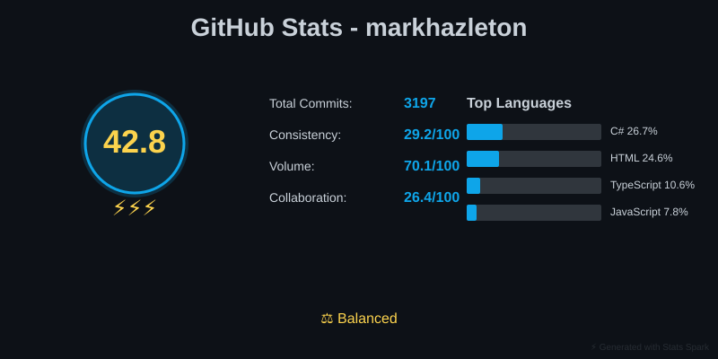
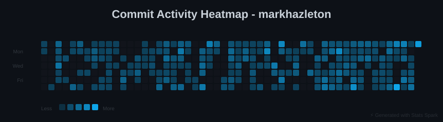
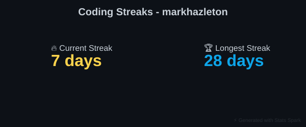
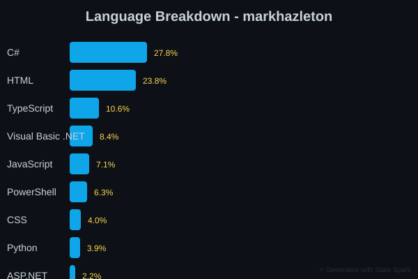
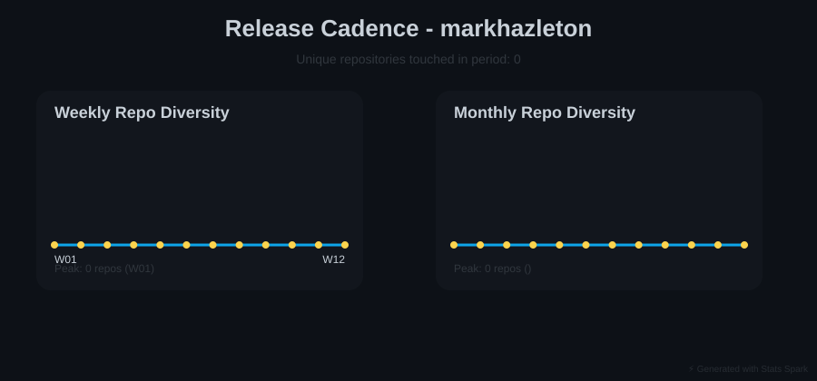

# GitHub Profile: markhazleton

**Generated**: 2026-03-22 00:51:22 UTC
**Report Version**: 1.0.0
**Repositories Analyzed**: 37
**AI Summary Rate**: 100.0%

> 💡 **Navigation**: [Profile Overview](#profile-overview) | [Top Repositories](#top-37-repositories) | [Metadata](#report-metadata)

---

## Profile Overview

### Activity Dashboard

### Commit Activity

### Technology Breakdown

### Release Patterns

---

## Top 37 Repositories

### #1. [github-stats-spark](https://github.com/markhazleton/github-stats-spark)

Stars: 0 | Forks: 0 | Language: Python | 187 commits (90d)

👥 0 contributors | 🌐 5 languages | 💾 10502 KB | 🚀 62.3 commits/month

**Quality**: ❌ License | ✅ Docs

# Technical Summary: github-stats-spark

## Overview
Stats Spark is a comprehensive GitHub analytics platform that automatically generates professional profile statistics and AI-powered repository analysis through SVG visualizations and markdown reports. The project transforms raw GitHub activity data into actionable insights by combining multiple analysis techniques: a proprietary "Spark Score" algorithm (weighing consistency, volume, and collaboration), AI-powered repository ranking, and Claude Haiku integration for technical summaries.

## Key Features & Architecture
The system operates through three primary components: **(1) SVG Statistics Generation** - creates embeddable visualizations including contribution heatmaps, language breakdowns, streak tracking, and personality-based achievement badges; **(2) AI-Powered Analysis** - leverages Claude Haiku with intelligent fallback mechanisms (README extraction, metadata aggregation) to achieve 97%+ summary generation success rates across repositories; **(3) Interactive Dashboard** - a mobile-first JavaScript application with Chart.js visualizations, bottom-sheet navigation patterns, offline IndexedDB caching support, and WCAG 2.1 AA accessibility compliance. The analysis algorithm employs weighted composite scoring (30% popularity, 45% time-decay activity, 25% health signals) to intelligently rank repositories while respecting GitHub API rate limits through smart caching strategies that reduce API calls by 80-95%.

## Technology Stack & Implementation
The backend leverages **Python 3.11+** with PyGithub for API interactions, PyYAML for configuration management, and svgwrite for programmatic SVG generation. The frontend uses **JavaScript/CSS/HTML** with responsive design patterns optimized for 320px-768px mobile viewports, featuring touch-optimized interfaces and <2s First Contentful Paint performance. The architecture is CI/CD integrated with GitHub Actions for automated midnight UTC updates and includes comprehensive error handling with exponential backoff retry logic.

## Unique Value Propositions
Stats Spark differentiates itself through its **zero-maintenance operational model** (set once, updates automatically), **visual personality-driven achievements** (8 custom achievement tiers based on coding patterns), and **three-tier AI summary fallback system** ensuring reliability even when primary AI services are unavailable. The project specifically targets developers building professional portfolios, technical leaders assessing productivity, and open-source maintainers tracking project momentum—addressing gaps in existing GitHub analytics tools by combining aesthetic visualizations with substantive technical analysis.

## Current Development Status
The repository shows **highly active, recently accelerated development** with 187 commits in the past 90 days matching the 365-day total, indicating momentum rather than legacy code. The 50/100 tech stack currency score reflects strategic use of stable, proven technologies (PyGithub, requests) balanced with modern tooling (Chart.js, mobile-first CSS patterns). The multi-language codebase (Python 49.5%, JavaScript 23.1%) and comprehensive test coverage indicate enterprise-ready maturity despite zero public stars or forks, suggesting either recent publication or private predecessor use.

**Technology Stack Currency**: ✅ 50/100
**Dependencies**: 10 total (10 current, 0 outdated)

**Created**: 2025-12-28
**Last Modified**: 2026-03-15

---

### #2. [mark-hazleton-s-notes](https://github.com/markhazleton/mark-hazleton-s-notes)

Stars: 0 | Forks: 0 | Language: TypeScript | 131 commits (90d)

👥 0 contributors | 🌐 5 languages | 💾 296949 KB | 🚀 43.7 commits/month

**Quality**: ❌ License | ✅ Docs

# Technical Summary: mark-hazleton-s-notes

This repository is a personal technical portfolio and blog site for Mark Hazleton, built as a modern static-generated React application that combines long-form technical writing, project showcases, and live GitHub metrics integration. The site leverages React 19, Vite 7 with SSR capabilities, and TypeScript to deliver a content-rich experience across blog posts, project portfolios, video galleries, and dynamic GitHub activity feeds, with content sourced from Markdown files and JSON metadata that are pre-rendered into static HTML at build time.

The architecture employs a sophisticated content pipeline using custom build scripts that orchestrate metadata generation, image optimization, RSS feed creation with Media RSS extensions, SEO asset generation (sitemaps, robots.txt, canonical tags), and live repository data fetching from an external GitHub stats service—all culminating in a statically-deployable `docs/` directory suitable for Azure Static Web Apps. The tech stack includes Tailwind CSS, shadcn/ui, and Radix UI for UI composition, React Markdown with remark-gfm for article rendering, and a dual-mode rendering strategy where development uses client-side data fetching while production builds fetch and embed repository metrics at prerender time for optimal performance and SEO.

What distinguishes this project is its production-grade approach to static site generation combined with dynamic data refresh capabilities, comprehensive SEO optimization (including video sitemaps and optimized image thumbnails for RSS), and a well-documented build process that balances developer experience with performance and maintainability. The repository structure includes a dedicated `.documentation/` directory with governance, specifications, and development guides, reflecting professional engineering practices typical of enterprise technical architecture—making this both a portfolio site and a demonstration of mature full-stack development workflows suitable for technical leaders and solutions architects evaluating modern web infrastructure patterns.

**Technology Stack Currency**: ✅ 50/100
**Dependencies**: 60 total (60 current, 0 outdated)

**Created**: 2026-01-10
**Last Modified**: 2026-03-20

---

### #3. [WebSpark.HttpClientUtility](https://github.com/markhazleton/WebSpark.HttpClientUtility)

Stars: 0 | Forks: 0 | Language: C# | 51 commits (90d)

👥 0 contributors | 🌐 6 languages | 💾 2340 KB | 🚀 17.0 commits/month

**Quality**: ❌ License | ✅ Docs

# Technical Summary: WebSpark.HttpClientUtility

## Overview
WebSpark.HttpClientUtility is a production-ready, drop-in HttpClient wrapper library for .NET 8-10 LTS that eliminates boilerplate HTTP setup by providing enterprise-grade resilience, response caching, structured logging with correlation IDs, and OpenTelemetry observability in a single `AddHttpClientUtility()` configuration call. The project is delivered as two focused NuGet packages: the core HTTP utility library (163 KB) and an optional Crawler extension (75 KB) for web scraping scenarios.

## Key Technical Features
The library integrates **Polly-based resilience patterns** (automatic retries, circuit breakers, timeout policies), **in-memory response caching** with configurable TTL, **distributed tracing support** via OpenTelemetry ActivitySource, and **automatic correlation ID propagation** for request tracking across microservices. It implements a service-based architecture centered around `IHttpRequestResultService` that returns typed `HttpRequestResult<T>` objects, enabling strongly-typed API interactions with built-in error handling. The implementation includes Source Link support for step-through debugging, trimming/AOT readiness with native compilation annotations, and zero-warning builds with strict code quality enforcement.

## Technology Stack & Architecture
Built entirely in C# targeting .NET 8+ LTS frameworks, the codebase follows dependency injection patterns compatible with Microsoft's DI container, leveraging Polly for resilience, ILogger for structured logging, and OpenTelemetry for observability instrumentation. The architecture separates concerns through focused packages and uses semantic versioning with backward-compatibility guarantees, automated CI/CD validation via GitHub Actions, and comprehensive test coverage across multiple .NET versions.

## Distinctive Characteristics
Unlike raw HttpClient setup (50+ lines), RestSharp, or Refit, WebSpark uniquely combines **one-line initialization** with **opinionated enterprise defaults** (caching, resilience, telemetry enabled by default) without sacrificing configurability. The project demonstrates strong production readiness through package validation baselines, zero breaking changes within major versions, comprehensive automated test coverage, and clear semantic versioning—making it suitable for risk-averse enterprises and microservice architectures requiring distributed tracing.

## Target Users & Use Cases
Ideal for teams building **microservices with observability requirements**, **background workers and integration layers** needing retry logic without manual Polly setup, and **web crawlers/scrapers** (via the Crawler package). Best suited for greenfield .NET 8+ projects prioritizing developer experience and operational transparency; not recommended for legacy .NET Framework projects, scenarios requiring maximum control, or teams needing declarative, type-safe API clients (where Refit is preferable).

**Created**: 2025-05-03
**Last Modified**: 2026-03-17

---

### #4. [MuseumSpark](https://github.com/markhazleton/MuseumSpark)

Stars: 0 | Forks: 0 | Language: Python | 67 commits (90d)

👥 0 contributors | 🌐 6 languages | 💾 25288 KB | 🚀 22.3 commits/month

**Quality**: ❌ License | ✅ Docs

# MuseumSpark - Technical Summary

**MuseumSpark** is an active, early-stage travel planning application that transforms the Walker Art Center's reciprocal membership program into an intelligent museum discovery platform for art enthusiasts across North America. The project currently tracks 1,269 museums and is in Phase 1 of a multi-phase data enrichment pipeline, with only 0.08% of records fully enriched but a clear architectural roadmap toward a personalized AI-assisted travel companion by Q4 2026.

The application features a React 19 + Vite frontend with Tailwind CSS styling deployed on GitHub Pages, providing users with comprehensive museum browsing, searching, filtering, and detail pages, alongside a real-time data quality dashboard tracking enrichment progress across states. The backend employs a sophisticated Python-based data pipeline leveraging Pydantic 2 for validation, JSON Schema enforcement, and multi-source enrichment (Wikidata, Wikipedia, museum websites, and structured scraping via BeautifulSoup4), with a clear "never replace known with null" data quality principle and evidence-tracking mechanisms.

The architecture is deliberately modular and phased: Phase 0–1 focuses on foundational data collection and validation; Phase 2 (Q2 2026) will introduce expert-driven priority scoring for art collections; Phase 2.5–3 will integrate LLM-assisted content extraction; and Phase 4 (Q4 2026) will add a FastAPI backend with user authentication, favorites, trip planning, and AI agents. The tech stack thoughtfully balances current needs (static React site for rapid iteration) with future scalability (FastAPI, SQLite, PydanticAI), and the project demonstrates strong engineering discipline with JSON Schema validation, multi-phase data sourcing, and transparent progress tracking.

MuseumSpark is notable for its transparent, data-driven approach to a niche problem—it treats museum curation as a first-class concern requiring structured scoring rather than simple directories—and targets serious art travelers and cultural enthusiasts seeking optimized itineraries. The project's accelerating activity (67 commits in 90 days), clear phasing, and commitment to data quality over feature bloat suggest mature project management, making it well-positioned for scaling toward full personalization features while maintaining data integrity.

**Created**: 2026-01-15
**Last Modified**: 2026-03-14

---

### #5. [UISampleSpark](https://github.com/markhazleton/UISampleSpark)

Stars: 8 | Forks: 4 | Language: HTML | 69 commits (90d)

👥 0 contributors | 🌐 6 languages | 💾 30744 KB | 🚀 23.0 commits/month

**Quality**: ❌ License | ✅ Docs

# UISampleSpark Technical Summary

**UISampleSpark** is an educational .NET 10 (ASP.NET Core) reference application that provides a comprehensive comparative study of modern web UI technologies by implementing the same Employee/Department domain across seven distinct architectural patterns: traditional MVC, Razor Pages, vanilla JavaScript SPA, React 18, Vue 3, htmx, and Blazor Server. The project demonstrates clean architecture principles through layered separation of concerns (UI, Core domain, Data, and service abstractions), featuring a RESTful API with Swagger/OpenAPI documentation, in-memory EF Core database operations, dependency injection patterns, and unit test coverage across domain and repository layers.

Key capabilities include dynamic Bootswatch theme switching with light/dark mode support, Bootstrap 5-based responsive UI components, modal-based form interactions, advanced data visualization through PivotTable.js reporting, and comprehensive health checks and Application Insights telemetry for observability. The technology stack leverages ASP.NET Core MVC/Razor Pages for server-side rendering, React and Vue for client-side component frameworks, and JavaScript-based HTTP utilities via custom `WebSpark.HttpClientUtility` NuGet packages, all containerized with Docker and deployed via GitHub Actions CI/CD pipelines with support for both Azure App Service and Docker Hub distribution.

The repository is architected using the repository pattern with service abstraction layer (`IEmployeeService`), clean separation between controller/page layer and data layer, and standardized REST client abstractions, making it an ideal reference for developers learning enterprise-grade .NET applications or comparing UI framework trade-offs within a production-like environment. Its rapid evolution from .NET 5 through .NET 10 (69 commits in 90 days, accelerating activity), combined with extensive CI/CD hardening, containerization examples, and real-world deployment demonstrations (Windows IIS VM and Docker deployments), positions this as both an educational tool and a living best-practices showcase for modern ASP.NET Core full-stack development.

**Created**: 2019-04-25
**Last Modified**: 2026-03-14

---

### #6. [git-spark](https://github.com/markhazleton/git-spark)

Stars: 0 | Forks: 0 | Language: TypeScript | 26 commits (90d)

👥 0 contributors | 🌐 6 languages | 💾 1948 KB | 🚀 8.7 commits/month

**Quality**: ❌ License | ✅ Docs

# Git Spark - Technical Summary

**Git Spark** is a TypeScript-based Git repository analytics and reporting tool that analyzes commit history to generate interactive insights into contributor activity, code changes, and development patterns. The tool operates as both a CLI application and Node.js library, offering multi-format export capabilities (HTML, JSON, CSV, Markdown) with a sophisticated interactive HTML dashboard featuring timeline visualizations, contribution heatmaps, governance radar charts, and risk factor analysis—all delivered as self-contained, security-hardened artifacts with strict Content Security Policy implementation and no external dependencies for charting.

The architecture employs a modular design stack built on TypeScript with minimal but strategic dependencies (commander for CLI, chalk/ora for terminal UI, boxen for formatting), demonstrating clean separation between data collection, analysis logic, and presentation layers across CLI and programmatic APIs. Key differentiators include privacy-conscious features like email redaction, timezone-aware daily trend analysis, accessible UI patterns (ARIA live regions, keyboard navigation, reduced-motion compliance), and enterprise-grade analytics documentation that transparently explains both capabilities and limitations of Git-based metrics rather than making unfounded claims about developer productivity.

The target audience spans development teams, engineering leaders, and auditors requiring repository health assessments, contributor pattern analysis, and governance compliance reporting—particularly organizations valuing air-gapped workflows and reproducible analysis artifacts. With 142 commits across a year of development, active maintenance through 26 recent commits, and a declining activity pattern, the project is mature enough for production use but represents a niche tool with limited current adoption (0 stars, 0 forks), making it suitable for teams with specific Git analytics needs rather than mainstream adoption.

**Technology Stack Currency**: ✅ 50/100
**Dependencies**: 19 total (19 current, 0 outdated)

**Created**: 2025-09-29
**Last Modified**: 2026-03-14

---

### #7. [TailwindSpark](https://github.com/markhazleton/TailwindSpark)

Stars: 0 | Forks: 0 | Language: TypeScript | 42 commits (90d)

👥 0 contributors | 🌐 7 languages | 💾 3971 KB | 🚀 14.0 commits/month

**Quality**: ❌ License | ✅ Docs

# TailwindSpark - Technical Summary

**TailwindSpark** is a comprehensive, production-ready Tailwind CSS design system and component showcase built as a modern React TypeScript monorepo. It serves as both a practical reference implementation and a portfolio demonstration of contemporary web development practices, featuring a complete suite of interactive UI components, design tokens, and real-world application examples (dashboard, e-commerce, marketing pages) built on React 19.1, TypeScript 5.9, and Tailwind CSS 4.1.18 with Vite 7.1 for fast development and optimized builds.

The project leverages a **Turborepo 2.7 monorepo architecture** to manage shared design tokens and reusable UI component packages, enabling code reuse across multiple applications while maintaining strict type safety and performance optimization through code splitting, lazy loading, and route-based chunking. Key technical highlights include 100% TypeScript strict mode, comprehensive accessibility compliance (WCAG 2.1 AA), automated testing with Vitest, real-time Core Web Vitals monitoring, and a fully automated CI/CD pipeline via GitHub Actions with security scanning, performance analytics, and continuous deployment to GitHub Pages.

What distinguishes TailwindSpark is its **dual purpose as both a working design system and an educational showcase**—it demonstrates advanced React patterns (concurrent features, error boundaries, Suspense), modern tooling best practices (ESLint 9, Prettier, TypeScript strict checks), and production-grade considerations like dark mode support, keyboard navigation, service worker integration, SEO optimization, and comprehensive documentation. The project is ideal for developers seeking a template for building scalable component libraries, those learning modern React and TypeScript patterns, teams implementing enterprise design systems, or portfolios demonstrating full-stack frontend excellence with accessibility and performance as first-class concerns.

**Technology Stack Currency**: ✅ 50/100
**Dependencies**: 27 total (27 current, 0 outdated)

**Created**: 2025-07-29
**Last Modified**: 2026-03-15

---

### #8. [RESTRunner](https://github.com/markhazleton/RESTRunner)

Stars: 2 | Forks: 1 | Language: C# | 46 commits (90d)

👥 0 contributors | 🌐 4 languages | 💾 870 KB | 🚀 15.3 commits/month

**Quality**: ❌ License | ✅ Docs

# RESTRunner - Technical Summary

**RESTRunner** is a comprehensive .NET 10 (LTS) solution for executing, testing, and benchmarking REST APIs, with primary support for importing and running Postman collections. The project provides both a console application and Razor Pages web interface, enabling users to perform automated regression testing, load testing, performance analysis, and detailed statistical reporting with CSV export capabilities.

The solution features native Postman collection integration, configurable load testing parameters, response time percentile analysis, a built-in sample CRUD API for demonstration, and comprehensive test coverage (100% pass rate with 21 tests). The architecture follows a modular design with separate domain, testing, and web presentation layers, leveraging .NET 10's performance improvements (19% faster builds, 25% faster test execution) while maintaining a lean dependency footprint with 93% of packages at latest versions and zero vulnerabilities.

The project targets QA engineers, API developers, and DevOps professionals who need automated API validation and performance monitoring without external SaaS dependencies. Recent activity shows accelerating development with 46 commits in the last 90 days, including a major v10.0.0 release upgrading to .NET 10 LTS with comprehensive package optimization and removal of framework-included dependencies, demonstrating a commitment to modern standards and maintainability.

**Created**: 2021-09-30
**Last Modified**: 2026-03-20

---

### #9. [WebProjectMechanics](https://github.com/markhazleton/WebProjectMechanics)

Stars: 3 | Forks: 0 | Language: Visual Basic .NET | 9 commits (90d)

👥 0 contributors | 🌐 10 languages | 💾 52407 KB | 🚀 3.0 commits/month

**Quality**: ❌ License | ✅ Docs

# Technical Summary: WebProjectMechanics

**WebProjectMechanics** is a greenfield rebuild of a 20+ year legacy multi-tenant content management system, designed to serve 36+ independent websites from a single application instance while dramatically reducing hosting costs to ~$10/month. The system publishes dynamic content to pre-rendered static HTML served by Caddy, eliminating runtime rendering overhead and enabling efficient CDN distribution; it achieves multi-tenancy through physical file isolation using per-site SQLite databases rather than logical tenant columns, providing strong data separation and simplified querying. Built on .NET 9 with ASP.NET Core Minimal APIs, Entity Framework Core, and Scriban templating, the architecture employs a plugin-based domain model supporting specialized content modules (CMS pages, mineral collections, recipes) that can be independently extended and deployed. The project is transitioning from a legacy ASP.NET Web Forms/MS Access stack using a comprehensive one-time data migration tool, with extensive documentation covering both the implementation roadmap and the legacy system's complete specification to facilitate knowledge transfer. Its unique approach combines vertical multi-tenancy (separate databases per domain) with a single application host, containerized deployment via systemd, and automated certificate management through Caddy, making it an exemplary case study in cost-effective legacy system modernization while maintaining backward compatibility and operational continuity.

**Created**: 2017-09-19
**Last Modified**: 2026-02-19

---

### #10. [WebSpark](https://github.com/markhazleton/WebSpark)

Stars: 1 | Forks: 0 | Language: C# | 14 commits (90d)

👥 0 contributors | 🌐 7 languages | 💾 69023 KB | 🚀 4.7 commits/month

**Quality**: ❌ License | ❌ Docs

# WebSpark - Technical Summary

**WebSpark** is a modular .NET 9 web application suite comprising three specialized tools: PromptSpark (LLM prompt optimization), RecipeSpark (recipe management), and TriviaSpark (quiz platform), all built with ASP.NET Core MVC and Bootstrap 5. The architecture is notably sophisticated, featuring seven modular areas with comprehensive SEO optimization including dynamic meta tags, JSON-LD structured data, canonical URL management, XML sitemaps, multi-engine verification, and Google Analytics 4 integration with Core Web Vitals tracking—backed by 47 passing SEO tests. The project implements a rigorous **spec-driven development workflow** through SpecKit commands that enforce quality gates: developers must create specifications, implementation plans, task breakdowns, and crucially, undergo adversarial risk assessment (the `/speckit.critic` command) before coding begins, with automated detection of showstoppers including ASP.NET anti-patterns, security vulnerabilities, and performance issues. The codebase is primarily C# (47%), HTML (40.4%), and SCSS (7%), maintained with strict branch protection rules and a constitutional governance framework, making it suitable for teams prioritizing risk mitigation and quality assurance in enterprise web development. The project remains actively maintained (14 commits in 90 days) despite minimal current adoption, suggesting it's either in early stages or represents internal tooling that could serve as a reference implementation for production-grade .NET applications.

**Created**: 2024-01-11
**Last Modified**: 2026-01-29

---

### #11. [ReactSparkPortfolio](https://github.com/markhazleton/ReactSparkPortfolio)

Stars: 0 | Forks: 0 | Language: CSS | 23 commits (90d)

👥 0 contributors | 🌐 6 languages | 💾 43594 KB | 🚀 7.7 commits/month

**Quality**: ❌ License | ✅ Docs

# ReactSparkPortfolio - Technical Summary

**ReactSparkPortfolio** is a production-ready, enterprise-grade developer portfolio built with React 19, TypeScript, and Vite that serves as both a personal showcase and a comprehensive reference implementation for modern full-stack web development. The application demonstrates advanced frontend architecture patterns including real-time communication via SignalR, responsive UI with Bootstrap 5 and custom SCSS theming (dark/light mode), lazy-loaded components with code splitting, and integration with multiple external APIs (OpenWeather, JokeAPI, RSS feeds) through a serverless backend proxy layer.

The project employs a cloud-native deployment strategy leveraging Azure Static Web Apps with GitHub Actions CI/CD automation, dual-platform hosting (Azure + GitHub Pages), and a TypeScript-strict codebase ensuring type safety across all 46 dependencies including axios, date-fns, Leaflet for interactive mapping, and xml2js for RSS parsing. Architecturally, it separates concerns between the React frontend (React Router navigation, Context API state management), serverless Azure Functions APIs, and external service integrations, with explicit attention to Content Security Policy configuration to balance security with functional requirements.

Key differentiators include full WCAG 2.1 AA accessibility compliance with semantic HTML and ARIA support, comprehensive documentation in the `/documentation` directory covering security, deployment, and development patterns, and a modular component structure with dedicated SCSS utilities enabling scalable styling conventions. The project is actively maintained (23 commits in 90 days) with a modern tech stack (50/100 currency score) and serves as an ideal reference for developers seeking to understand enterprise-grade React patterns, TypeScript best practices, and cloud deployment workflows for production web applications.

**Technology Stack Currency**: ✅ 50/100
**Dependencies**: 46 total (46 current, 0 outdated)

**Created**: 2024-10-11
**Last Modified**: 2026-03-07

---

### #12. [JsBootSpark](https://github.com/markhazleton/JsBootSpark)

Stars: 0 | Forks: 0 | Language: JavaScript | 22 commits (90d)

👥 0 contributors | 🌐 6 languages | 💾 3448 KB | 🚀 7.3 commits/month

**Quality**: ❌ License | ✅ Docs

# JsBootSpark - Technical Summary

**JsBootSpark** is a production-ready, full-stack starter kit designed to accelerate web application development by combining Express.js backend capabilities with Bootstrap 5.3 frontend components. The project serves as a comprehensive boilerplate that abstracts away common configuration and setup tasks, enabling developers to begin building feature-rich applications immediately without reinventing foundational infrastructure.

The platform demonstrates mature architectural decisions including hot-reload development workflows, SASS preprocessing, comprehensive security middleware (Helmet.js, rate limiting, CSP), and progressive web app capabilities with service worker support. It features 2,000+ Bootstrap Icons, dark/light mode toggling, responsive design patterns, and a component library with interactive examples, while backend capabilities include dynamic page generation from templates, CSV-to-JSON conversion for static data handling, and automated build optimization with performance tracking.

The tech stack leverages modern JavaScript tooling (Node.js 18+, Express 5.1+, EJS templating) with 30 dependencies carefully curated for production use, complemented by ESLint/Prettier for code consistency, Jest for testing, and Docker support for containerized deployment. The project implements an opinionated, DevOps-friendly architecture with GitHub Actions CI/CD integration, GitHub Pages deployment pipeline, subdirectory path conversion for flexible hosting, and automated static site generation capabilities that can produce 100+ pages from single templates.

The repository targets full-stack JavaScript developers, teams building internal tools, and organizations seeking accelerated prototyping workflows, offering documentation structured by audience (quick starts, developer guides, architectural decisions), real-time copilot session tracking, and a consistent activity pattern showing ongoing maintenance and feature development. Its 3,448 KB footprint and modular structure position it as an enterprise-friendly starter that balances convenience with minimal bloat while maintaining 50/100 tech stack currency with active dependency management.

**Technology Stack Currency**: ✅ 50/100
**Dependencies**: 30 total (30 current, 0 outdated)

**Created**: 2022-06-06
**Last Modified**: 2026-01-31

---

### #13. [markhazleton](https://github.com/markhazleton/markhazleton)

Stars: 0 | Forks: 0 | Language: Unknown | 16 commits (90d)

👥 0 contributors | 🌐 1 languages | 💾 6603 KB | 🚀 5.3 commits/month

**Quality**: ❌ License | ❌ Docs

# Technical Summary: markhazleton Repository

This repository serves as a **personal portfolio and learning archive** for Mark Hazleton, functioning as a curated collection of his professional development projects and technical explorations rather than a traditional single-purpose codebase. The repository showcases multiple featured projects, most notably **Spec-Kit-Spark** (a fork of GitHub's SpecKit for brownfield development) and **ReactSpark** (a React-based web application built with Vite and deployed on Azure Static Web Applications), demonstrating expertise across full-stack development patterns. The technology stack spans modern web frameworks (React, Vite), .NET/NuGet ecosystem development, cloud platforms (Azure), and API development tools (evidenced by projects like RESTRunner for API load testing), indicating proficiency in both frontend and backend technologies. The repository emphasizes pragmatic software development practices through accompanying blog articles covering topics like evolutionary architecture, DevOps governance, and outcome-driven feature development, positioning the owner as someone focused on both technical excellence and engineering leadership. The active commit history (accelerating activity pattern with 55 commits over the past year) and integration with custom GitHub statistics visualization (github-stats-spark) suggest a professionally maintained learning portfolio designed for continuous knowledge documentation and skill demonstration. This repository is primarily valuable for prospective employers, collaborators, or learners seeking examples of modern development practices, architectural patterns, and a developer's technical growth trajectory.

**Created**: 2021-04-17
**Last Modified**: 2026-03-20

---

### #14. [KeyPressCounter](https://github.com/markhazleton/KeyPressCounter)

Stars: 2 | Forks: 1 | Language: C# | 3 commits (90d)

👥 0 contributors | 🌐 1 languages | 💾 46575 KB | 🚀 1.0 commits/month

**Quality**: ❌ License | ✅ Docs

# KeyPressCounter - Technical Summary

**KeyPressCounter** is a lightweight Windows system tray utility built in C# (.NET 10.0) that monitors keyboard and mouse activity alongside real-time system performance metrics, designed to run silently in the background without recording keystroke content or transmitting data. The application provides comprehensive input tracking (keystroke/click counts, peak activity rates, inactivity detection) and performance monitoring (CPU, memory, disk I/O, network throughput) through a three-tab WinForms dashboard with 60-second rolling graphs, hardware information via WMI, and configurable activity logging with daily summaries.

The architecture leverages **SharpHook** for global low-level input event hooking on background threads, **System.Management** for WMI-based hardware enumeration and Windows Performance Counters for real-time system metrics, and implements thread-safe counters with lock-protected increments to handle concurrent input events. Key design patterns include an `ApplicationContext` subclass managing tray integration and lifecycle, GDI+ anti-aliased graph rendering for historical data visualization, P/Invoke wrappers around `GetLastInputInfo` for idle detection, and JSON configuration persistence with Windows Registry synchronization for autostart capabilities.

Notable features include idle-period filtering with configurable thresholds, single-instance enforcement, direct access to Windows system tools (Task Manager, Resource Monitor, Performance Monitor), and comprehensive logging at user-configurable intervals with automatic daily summary generation at midnight. The project targets individual users and productivity analysts seeking passive activity monitoring and system performance awareness without privacy concerns, with declining recent activity (3 commits in 90 days) suggesting maintenance mode rather than active development, though the codebase demonstrates professional separation of concerns and Windows-native integration patterns suitable for production desktop applications.

**Technology Stack Currency**: ✅ 50/100
**Dependencies**: 3 total (3 current, 0 outdated)

**Created**: 2024-03-07
**Last Modified**: 2026-03-09

---

### #15. [Texecon](https://github.com/markhazleton/Texecon)

Stars: 0 | Forks: 0 | Language: HTML | 16 commits (90d)

👥 0 contributors | 🌐 4 languages | 💾 4491 KB | 🚀 5.3 commits/month

**Quality**: ❌ License | ❌ Docs

# Technical Summary: TexEcon

**TexEcon** is a modern static React application designed to deliver expert economic analysis and commentary on the Texas economy, deployed as a high-performance static site on GitHub Pages. The project leverages React 19, TypeScript, and Vite to implement a sophisticated build-time content management system that fetches fresh data from a WebSpark headless CMS during compilation, with graceful fallback mechanisms ensuring reliability even when the API is unavailable. The architecture employs a multi-stage build pipeline that orchestrates content fetching, sitemap generation, Vite compilation, and static HTML page generation—enabling optimal SEO performance and Core Web Vitals scores through pre-rendered pages while maintaining client-side routing capabilities via Wouter for progressive enhancement. The technology stack combines Tailwind CSS 4.1 for styling, Radix UI primitives with shadcn/ui components for accessible UI construction, and Lucide React for consistent iconography, while TypeScript-first development ensures type safety throughout the application. What distinguishes TexEcon is its sophisticated content pipeline with build-time API integration, automatic type generation from CMS responses, detailed build reporting, and configurable deployment strategies supporting both GitHub Pages subdomains and custom domains (texecon.com)—making it a reference implementation for static site generation with dynamic content integration. This approach is particularly valuable for organizations requiring SEO-optimized, performant web properties that need to serve frequently-updated content while maintaining the simplicity and cost-efficiency of static hosting.

**Technology Stack Currency**: ✅ 50/100
**Dependencies**: 40 total (40 current, 0 outdated)

**Created**: 2025-09-03
**Last Modified**: 2026-03-08

---

### #16. [SupportSpark](https://github.com/markhazleton/SupportSpark)

Stars: 0 | Forks: 0 | Language: TypeScript | 23 commits (90d)

👥 0 contributors | 🌐 5 languages | 💾 1954 KB | 🚀 7.7 commits/month

**Quality**: ❌ License | ❌ Docs

# SupportSpark - Technical Summary

**SupportSpark** is a compassionate support network platform built with TypeScript and React that enables members navigating life challenges to post journey updates to a trusted circle of supporters, who can respond with encouragement through threaded conversations. The platform implements a role-based access model where members create and manage updates while supporters have read and reply permissions, solving the problem of exhausting one-to-many communication during difficult periods by providing a single posting mechanism that reaches all invited supporters simultaneously.

The application leverages a modern, type-safe tech stack featuring **React 19 with Vite** for the frontend, **Express 5** for the RESTful API backend, **Tailwind CSS 4** and **shadcn/ui** components for accessible, calming UI design, **TanStack React Query** for server state management, and **Zod** for runtime validation—all written in strict TypeScript for end-to-end type safety. The architecture emphasizes accessibility through Radix UI primitives, smooth animations via Framer Motion, and a distraction-free, thoughtfully designed interface using a sage/teal color palette appropriate for sensitive moments.

Unique features include a fully functional **demo mode** running entirely in-browser with localStorage persistence, allowing users to explore without backend infrastructure, along with **GitHub Pages static deployment** capabilities for alpha previews. The project is production-ready with specialized support for **Windows 11 IIS deployment** via automated PowerShell scripts and iisnode integration, comprehensive API contracts defined through shared schemas, and well-documented architectural principles stored in a "constitution" governance document.

The platform targets individuals managing health challenges, life transitions, or personal journeys who need to keep loved ones informed without the burden of repeated updates, while simultaneously providing supporters with an organized, focused space to offer encouragement—making it ideal for cancer patients, new parents, caregivers, and anyone experiencing significant life events requiring ongoing community support.

**Technology Stack Currency**: ✅ 50/100
**Dependencies**: 97 total (97 current, 0 outdated)

**Created**: 2026-02-01
**Last Modified**: 2026-02-25

---

### #17. [ConcurrentProcessing](https://github.com/markhazleton/ConcurrentProcessing)

Stars: 0 | Forks: 0 | Language: C# | 2 commits (90d)

👥 0 contributors | 🌐 1 languages | 💾 145 KB | 🚀 0.7 commits/month

**Quality**: ❌ License | ✅ Docs

# Technical Summary: ConcurrentProcessing

**ConcurrentProcessing** is a demonstration framework for .NET 10 that provides a production-ready, high-performance concurrent task processing engine built on C# and the Task Parallel Library (TPL). The framework centers on a generic abstract base class (`ConcurrentProcessor<T>`) that enables fine-grained control over parallel task execution through semaphore-based throttling, allowing developers to limit concurrent operations while tracking detailed performance metrics including task duration, wait times, and throughput statistics. Key features include type-safe generic results, automatic performance telemetry collection via `ConcurrentProcessorModel`, and a `MetricCalculator` utility for statistical analysis—all demonstrating contemporary C# patterns such as Template Method, Factory, and Resource Pool patterns. The architecture prioritizes minimal overhead and memory efficiency, with benchmarks showing linear scalability from 100 to 1000+ tasks across configurable concurrency limits, making it suitable for CPU-bound and I/O-bound workloads requiring controlled parallelism. Target users include C# developers seeking to understand advanced concurrent programming concepts, those building batch processing or task scheduling systems, and teams needing extensible frameworks with built-in observability. The project is well-documented with comprehensive guides, CI/CD automation via GitHub Actions, and serves dual purposes as both a production-ready utility and an educational resource for mastering .NET concurrency patterns and performance optimization.

**Technology Stack Currency**: ✅ 50/100
**Dependencies**: 2 total (2 current, 0 outdated)

**Created**: 2023-09-18
**Last Modified**: 2026-01-22

---

### #18. [markhazleton.github.io](https://github.com/markhazleton/markhazleton.github.io)

Stars: 0 | Forks: 0 | Language: SCSS | 1 commits (90d)

👥 0 contributors | 🌐 4 languages | 💾 148 KB | 🚀 0.3 commits/month

**Quality**: ❌ License | ✅ Docs

# Technical Summary: markhazleton.github.io

This repository hosts Mark Hazleton's personal portfolio website built with **Jekyll**, a static site generator hosted on **GitHub Pages**, with automated CI/CD deployment via **GitHub Actions**. The project implements a customized **Minima theme** using a modern tech stack of SCSS (36.8%), HTML (34.6%), and CSS (27.9%), featuring a dark/light mode toggle, responsive design, and native emoji support without external framework dependencies. The site architecture follows Jekyll's conventional structure with modular components (`_layouts`, `_includes`, `_sass`), facilitating maintainable content management and styling while leveraging GitHub Pages' native Jekyll support for streamlined deployment. Key technical features include live-reload development environment, Ruby 3.2.2+ dependency management via Bundler, comprehensive post metadata handling (categories, tags, excerpts, SEO optimization), and Windows-optimized development setup through the `wdm` gem. The project demonstrates declining but steady maintenance activity (1 commit in 90 days, 16 in 365 days) with moderate tech stack currency (50/100), making it suitable for professionals seeking a lightweight, customizable blogging platform with minimal infrastructure overhead and integrated version control workflows. Target users include developers and technical writers who prefer Jekyll's simplicity over headless CMS solutions and value direct Git-based content publishing with complete design control.

**Technology Stack Currency**: ✅ 50/100
**Dependencies**: 3 total (3 current, 0 outdated)

**Created**: 2021-04-18
**Last Modified**: 2026-01-12

---

### #19. [FastEndpointApi](https://github.com/markhazleton/FastEndpointApi)

Stars: 2 | Forks: 1 | Language: HTML | 1 commits (90d)

👥 0 contributors | 🌐 3 languages | 💾 137 KB | 🚀 0.3 commits/month

**Quality**: ❌ License | ✅ Docs

# Technical Summary: FastEndpointApi

**FastEndpointApi** is a comprehensive demonstration and educational project showcasing the FastEndpoints framework—a lightweight, high-performance REST API framework for ASP.NET Core that implements the REPR (Request-Endpoint-Response) pattern. The repository contains a fully functional Person Management API deployed to Azure, featuring complete CRUD operations, in-memory data persistence, service layer abstraction, and interactive Swagger documentation. Built with .NET 10.0 and FastEndpoints 7.1.1, the project leverages modern technologies including dependency injection, automatic request-response mapping, HATEOAS hypermedia links, and GitHub Actions CI/CD pipelines for automated deployment. The architecture emphasizes clean code principles and minimal boilerplate through endpoint-based organization rather than traditional MVC controllers, with integrated data seeding via Bogus and a Bootstrap 5-based HTML frontend for interactive API testing. This repository serves as both a learning resource and production-ready reference implementation for developers seeking to understand FastEndpoints' capabilities, particularly those looking to streamline ASP.NET Core API development while maintaining separation of concerns and high performance standards. The project is actively maintained with comprehensive documentation, live demo accessibility, and clear examples of advanced patterns like HATEOAS implementation and structured error handling.

**Created**: 2024-04-06
**Last Modified**: 2026-01-12

---

### #20. [MechanicsOfMotherhood](https://github.com/markhazleton/MechanicsOfMotherhood)

Stars: 0 | Forks: 0 | Language: TypeScript | 14 commits (90d)

👥 0 contributors | 🌐 5 languages | 💾 6719 KB | 🚀 4.7 commits/month

**Quality**: ❌ License | ✅ Docs

# Technical Summary: Mechanics of Motherhood

**Mechanics of Motherhood** is a modern recipe management platform built as a React 19 + TypeScript single-page application (SPA) designed specifically for busy working mothers seeking organized meal planning solutions. The platform features 108+ curated recipes with smart categorization, advanced search and filtering capabilities, and a mobile-first responsive design powered by Vite, Tailwind CSS, and Shadcn/ui component library. The architecture leverages TanStack React Query for efficient server state management and data caching, integrates with real-time APIs (RecipeSpark and WebCMS) for dynamic recipe content, and implements automated CI/CD pipelines via GitHub Actions for seamless deployment to a custom domain with GitHub Pages CDN distribution.

The project demonstrates production-ready best practices including comprehensive TypeScript type safety, WCAG accessibility compliance, PWA capabilities with offline support, automated data quality validation, SEO optimization with structured data and sitemaps, and Lighthouse performance scores exceeding 95 across all metrics. Key technical differentiators include a lightweight routing solution with Wouter, industrial-themed UI aesthetics, ~130KB gzipped bundle size with code splitting, and robust error handling with API fallback mechanisms to mock data. The codebase is well-structured with clear separation of concerns across components, pages, data layers, and utilities, making it maintainable and extensible for future enhancements or community contributions focused on recipe discovery, meal planning, and nutritional information management for its target demographic of time-constrained parents.

**Technology Stack Currency**: ✅ 50/100
**Dependencies**: 42 total (42 current, 0 outdated)

**Created**: 2025-09-01
**Last Modified**: 2026-03-09

---

### #21. [sql2csv](https://github.com/markhazleton/sql2csv)

Stars: 0 | Forks: 0 | Language: C# | 6 commits (90d)

👥 0 contributors | 🌐 6 languages | 💾 2004 KB | 🚀 2.0 commits/month

**Quality**: ❌ License | ✅ Docs

# Technical Summary: sql2csv

**sql2csv** is a comprehensive .NET 10 toolkit for SQLite database analysis and data extraction, providing both command-line and web-based interfaces for discovering databases, exporting tables to CSV format, inspecting schemas, and automatically generating C# data transfer objects (DTOs). The solution follows a modular architecture with a shared core library (`Sql2Csv.Core`) serving dual CLI (`sql2csv.console`) and ASP.NET Core MVC web (`sql2csv.web`) frontends, complemented by dedicated projects for testing (MSTest) and performance benchmarking (BenchmarkDotNet). Key capabilities include recursive SQLite file discovery, selective or bulk table export with CSV serialization, multi-format schema reporting (text/JSON/Markdown), and intelligent C# DTO generation with customizable namespacing, enabling developers to rapidly integrate SQLite data into .NET applications. The project demonstrates modern .NET practices including configuration management via `appsettings.json`, comprehensive test coverage with CI/CD integration (GitHub Actions), and a hybrid tech stack combining C# backend logic with HTML/CSS/JavaScript frontend components, making it well-suited for database migration workflows, data integration pipelines, and rapid prototyping scenarios involving SQLite databases.

**Created**: 2017-11-06
**Last Modified**: 2026-01-12

---

### #22. [PromptSpark.Chat](https://github.com/markhazleton/PromptSpark.Chat)

Stars: 0 | Forks: 0 | Language: C# | 10 commits (90d)

👥 0 contributors | 🌐 5 languages | 💾 19888 KB | 🚀 3.3 commits/month

**Quality**: ❌ License | ✅ Docs

# PromptSpark.Chat - Technical Summary

**PromptSpark.Chat** is a real-time conversational workflow engine built with ASP.NET Core and SignalR that enables users to navigate multi-step processes through an interactive chat interface powered by Adaptive Cards. The application provides server-side conversation persistence, allowing users to maintain their workflow progress across browser sessions without data loss, and supports optional AI integration for handling out-of-workflow queries through chat completion services. The architecture leverages a thread-safe ConcurrentDictionary for state management, JSON-based workflow definitions with branching logic, and real-time bidirectional communication via SignalR, demonstrating a lightweight yet scalable approach to guided user interactions and form workflows. The technology stack combines ASP.NET Core backend (31.5% C#) with a modern frontend composed of SCSS (30%), HTML (28.4%), and JavaScript (8.9%), offering both styling flexibility and interactivity across the chat UI. This solution is particularly well-suited for enterprise guidance systems, customer onboarding flows, interactive questionnaires, and decision-tree applications where maintaining context and providing responsive feedback are critical, while its modular workflow definition system allows non-developers to configure new processes without code changes. The project's recent acceleration in commits and active development pattern, combined with its comprehensive documentation and MIT licensing, positions it as a practical template for organizations building conversational AI or workflow automation features within the .NET ecosystem.

**Created**: 2024-12-31
**Last Modified**: 2026-02-10

---

### #23. [WebSpark.ArtSpark](https://github.com/markhazleton/WebSpark.ArtSpark)

Stars: 0 | Forks: 0 | Language: C# | 7 commits (90d)

👥 0 contributors | 🌐 5 languages | 💾 3658 KB | 🚀 2.3 commits/month

**Quality**: ❌ License | ✅ Docs

# Technical Summary: WebSpark.ArtSpark

**WebSpark.ArtSpark** is a comprehensive .NET 10.0 solution that provides a complete client library and interactive web application for the Art Institute of Chicago's public REST API, implementing all 33 endpoints across 6 major categories with strongly-typed C# models and async/await patterns. The solution's standout feature is its revolutionary AI chat system with multiple personas (Artwork, Artist, Curator, Historian) that leverage OpenAI's Vision and language models to enable conversational interactions with artwork data, complete with persistent chat history, visual analysis capabilities, and externalized prompt management for hot-reloading persona definitions. The architecture comprises four main projects—a reusable Client library, an AI Agent system with configurable prompts and conversation memory, an ASP.NET Core MVC Demo application with user authentication/collections, and a Console utility—demonstrating modern .NET development practices including dependency injection, IIIF image URL construction, Elasticsearch integration, and JSON deserialization using System.Text.Json. Key technical highlights include minimal external dependencies, graceful HTTP error handling, flexible querying with pagination and field selection, responsive Bootstrap 5 UI with 26+ theme support, and SQLite-backed user persistence, all documented with a live demo at artspark.markhazleton.com. The project targets developers and cultural institutions seeking to build intelligent art discovery applications while showcasing best practices in .NET ecosystem development, API client design, and AI integration patterns.

**Created**: 2023-01-30
**Last Modified**: 2026-01-12

---

### #24. [AsyncSpark](https://github.com/markhazleton/AsyncSpark)

Stars: 0 | Forks: 0 | Language: C# | 9 commits (90d)

👥 0 contributors | 🌐 6 languages | 💾 1925 KB | 🚀 3.0 commits/month

**Quality**: ❌ License | ✅ Docs

# AsyncSpark - Technical Summary

AsyncSpark is a production-ready reference implementation demonstrating enterprise-grade async/await patterns in .NET 10, designed to serve as both a learning resource and architectural blueprint for building resilient, scalable distributed systems. The project implements comprehensive async best practices including ConfigureAwait(false) library usage, proper CancellationToken threading, Task.WhenAll parallelization, SemaphoreSlim throttling, and Polly-based resilience policies (retry, timeout, circuit breaker), with each pattern linked to specific code examples and unit tests. Built on ASP.NET Core with 80% code coverage enforcement, the architecture emphasizes dependency injection, the decorator pattern for cross-cutting concerns (telemetry, caching, logging), and clean separation between a core utility library, web API, weather service integration, and comprehensive test suite. The repository uniquely implements "constitution-driven development," a formalized governance model that enforces coding standards and architectural patterns through automated CI/CD audits, constitution compliance checks, and structured PR reviews—demonstrated through audit reports and SpecKit agent workflows. The project includes interactive Scalar-powered API documentation with live testing capabilities, exposing endpoints for cancellation patterns, concurrency comparisons, remote operations, and real OpenWeatherMap API integration, making it valuable for enterprise teams adopting async patterns and organizations seeking to implement automated compliance frameworks. The 9 recent commits and maintained activity level indicate ongoing refinement, with contributions spanning C# (43.1%), HTML (34.1%), PowerShell (18.8%), and supporting configuration files that collectively demonstrate modern .NET development practices with constitutional enforcement mechanisms.

**Created**: 2022-08-07
**Last Modified**: 2026-02-10

---

### #25. [WebSpark.Bootswatch](https://github.com/markhazleton/WebSpark.Bootswatch)

Stars: 0 | Forks: 0 | Language: HTML | 5 commits (90d)

👥 0 contributors | 🌐 5 languages | 💾 7124 KB | 🚀 1.7 commits/month

**Quality**: ❌ License | ✅ Docs

# Technical Summary: WebSpark.Bootswatch

**WebSpark.Bootswatch** is a .NET 10-exclusive Razor Class Library that provides seamless integration of Bootswatch themes into ASP.NET Core applications, enabling developers to quickly implement modern, responsive UI theming with Bootstrap 5 as the foundation. The library offers comprehensive theming capabilities including dynamic theme switching, light/dark mode support, and built-in caching mechanisms through the `StyleCache` service, while providing convenient abstractions via extension methods and custom tag helpers like `<bootswatch-theme-switcher />` for straightforward UI implementation. Built primarily with HTML (63.8%), C# (28.6%), and JavaScript (2.6%), the project leverages the Microsoft.Extensions ecosystem and the external `WebSpark.HttpClientUtility` package to handle HTTP operations and dependency injection patterns within the ASP.NET Core middleware pipeline.

The architecture emphasizes production-readiness with comprehensive error handling, fallback mechanisms, and full XML documentation support for IntelliSense integration, while the recent major version 2.0 release represents a strategic decision to prioritize latest package versions and .NET 10 performance improvements over broad framework compatibility—a trade-off that simplifies maintenance and reduces testing complexity. The library targets ASP.NET Core developers seeking an opinionated, batteries-included solution for theme management rather than implementing theming from scratch, with particular utility for multi-tenant applications or projects requiring flexible visual branding and accessibility support through light/dark mode variants. While currently showing declining activity (5 commits in 90 days), the project maintains active curation with clear versioning strategy and documented migration paths, making it suitable for enterprise applications that prioritize modern .NET versions and staying current with framework releases.

**Created**: 2022-08-24
**Last Modified**: 2026-01-12

---

### #26. [TaskListProcessor](https://github.com/markhazleton/TaskListProcessor)

Stars: 0 | Forks: 0 | Language: C# | 12 commits (90d)

👥 0 contributors | 🌐 3 languages | 💾 1070 KB | 🚀 4.0 commits/month

**Quality**: ❌ License | ✅ Docs

# TaskListProcessor - Technical Summary

**TaskListProcessor** is an enterprise-grade .NET 10.0 library designed for orchestrating complex asynchronous operations with production-ready resilience, observability, and scheduling capabilities. The library provides a comprehensive framework for coordinating concurrent tasks—such as API calls, database queries, and microservice interactions—while maintaining fault isolation through circuit breaker patterns, comprehensive telemetry via OpenTelemetry integration, and advanced scheduling with dependency resolution and priority-based execution.

The project implements sophisticated architectural patterns including dependency injection integration with .NET's native DI container, the decorator pattern for pluggable cross-cutting concerns, interface segregation following SOLID principles, and thread-safe concurrent processing with configurable concurrency limits and load balancing. Key capabilities encompass type-safe result handling with categorized error management, task dependency resolution with topological sorting, streaming results via async enumerables, timeout/cancellation support, and health check monitoring—all backed by rich telemetry for metrics, tracing, and structured logging compatible with Serilog and Microsoft.Extensions.Logging.

The codebase is primarily C# (94.4%) with supporting PowerShell and Python tooling, demonstrates active development with 31 commits over the past year and accelerating momentum, and is positioned as a pre-release NuGet package targeting developers building high-throughput, fault-tolerant systems in microservices, data processing pipelines, and distributed applications. The project differentiates itself through enterprise-grade patterns, comprehensive documentation across multiple learning paths (beginner to advanced), practical examples including an interactive web demo, and production-focused guidance on performance tuning, memory optimization, and battle-tested architectural strategies.

**Created**: 2023-11-09
**Last Modified**: 2026-01-12

---

### #27. [WebSpark.PrismSpark](https://github.com/markhazleton/WebSpark.PrismSpark)

Stars: 0 | Forks: 0 | Language: C# | 14 commits (90d)

👥 0 contributors | 🌐 5 languages | 💾 2272 KB | 🚀 4.7 commits/month

**Quality**: ❌ License | ✅ Docs

# Technical Summary: WebSpark.PrismSpark

**WebSpark.PrismSpark** is a high-performance C#/.NET port of the popular PrismJS syntax highlighting library, providing advanced code tokenization and HTML rendering for 24 programming languages with support for .NET 10.0 LTS. The project implements a sophisticated architecture featuring a grammar-based tokenization engine, extensible plugin and hook systems, and a theme manager that supports both built-in and custom CSS-based themes, enabling developers to integrate professional syntax highlighting into web applications, documentation platforms, and code editors. Built with performance as a core concern, the library offers async processing, caching mechanisms, and flexible options for line highlighting, custom CSS classes, and metadata-driven customization, while maintaining full compatibility with ASP.NET MVC/Razor views through dependency injection integration. The codebase is well-engineered with a comprehensive 52-test MSTest suite covering grammar creation, tokenization, HTML generation, and end-to-end integration workflows, along with interactive demo pages including a live editor and markdown renderer powered by Markdig. What distinguishes this project is its seamless .NET ecosystem integration through service registration patterns, rendering capabilities that go beyond tokenization to produce fully styled HTML output, and a developer-friendly API that balances simplicity for common use cases with deep extensibility for advanced scenarios. This makes it particularly valuable for .NET developers building documentation systems, code review platforms, educational tools, or any application requiring embeddable, themeable syntax highlighting without JavaScript dependencies.

**Created**: 2025-05-27
**Last Modified**: 2026-02-11

---

### #28. [DecisionSpark](https://github.com/markhazleton/DecisionSpark)

Stars: 0 | Forks: 0 | Language: C# | 14 commits (90d)

👥 0 contributors | 🌐 4 languages | 💾 519 KB | 🚀 4.7 commits/month

**Quality**: ❌ License | ✅ Docs

# DecisionSpark - Technical Summary

**DecisionSpark** is a .NET 10-based decision routing engine that implements an intelligent conversation system to guide users through minimal questioning and recommend optimal outcomes using a config-driven architecture. The system combines a RESTful API with an interactive Razor Pages web interface, leveraging OpenAI integration for natural language question generation and answer parsing while maintaining conversation state through file-based session persistence. The architecture features modular service components including a RoutingEvaluator for rule-based decision logic, TraitParser for structured data extraction, and DecisionSpecLoader for JSON-based configuration management, enabling domain-specific decision flows without code modifications. Key capabilities include support for multiple question types (text, single-select, multi-select), Swagger/OpenAPI documentation, structured logging via Serilog, and intelligent rule evaluation with derived traits and tie-breaking mechanisms for complex decision scenarios. The project targets practical use cases such as activity planning (e.g., "Family Saturday Planner") and technical decision-making (e.g., "Tech Stack Advisor"), making it suitable for applications requiring interactive guidance systems, recommendation engines, or conversational decision support. Despite having zero stars and contributors at launch (created October 2025), the repository shows active development momentum with 14 commits over 90 days and 18 over the past year, indicating ongoing refinement and feature acceleration.

**Created**: 2025-10-29
**Last Modified**: 2025-12-27

---

### #29. [DocSpecSpark](https://github.com/markhazleton/DocSpecSpark)

Stars: 0 | Forks: 0 | Language: Python | 2 commits (90d)

👥 0 contributors | 🌐 4 languages | 💾 181 KB | 🚀 0.7 commits/month

**Quality**: ❌ License | ✅ Docs

# DocSpecSpark - Technical Summary

DocSpecSpark is a document-first framework and CLI tool that automates the initialization, generation, and publication of company documentation repositories with profile-based templating and static site generation capabilities. The project provides a comprehensive system for bootstrapping documentation infrastructure, including a Python-based CLI package (built with Typer for command structure), a modular framework payload with filesystem-backed templates, and a complete publication pipeline that renders markdown documents, builds static sites, and packages versioned release bundles for distribution. The architecture emphasizes profile-aware customization through YAML-driven configuration (constitution and config files), with concrete starter templates for diverse organizational contexts (nonprofits, startups, small manufacturers, enterprises, healthcare), allowing companies to scaffold documentation repositories tailored to their specific profile and governance needs. Key capabilities include document rendering from reusable templates, local site preview via `docspec serve`, automated GitHub Pages publication workflows, and versioned release snapshots that snapshot documentation states to `.DocSpecSpark/releases/` with corresponding zip distributions. The tech stack is modern and minimal—leveraging markdown-it-py for parsing, PyYAML for configuration management, Rich for CLI output formatting, and Typer for command definition—reflecting a pragmatic approach to documentation infrastructure without heavyweight dependencies. This tool is particularly valuable for organizations needing standardized, scalable documentation practices, offering an opinionated but flexible framework that balances template reusability with organizational customization, positioning it as a bridge between documentation-as-code philosophies and practical enterprise governance needs.

**Technology Stack Currency**: ✅ 50/100
**Dependencies**: 4 total (4 current, 0 outdated)

**Created**: 2026-03-07
**Last Modified**: 2026-03-08

---

### #30. [HttpClientDecoratorPattern](https://github.com/markhazleton/HttpClientDecoratorPattern)

Stars: 0 | Forks: 0 | Language: HTML | 1 commits (90d)

👥 0 contributors | 🌐 4 languages | 💾 2675 KB | 🚀 0.3 commits/month

**Quality**: ❌ License | ✅ Docs

# Technical Summary: HttpClientDecoratorPattern

## Overview & Purpose
This repository is a production-ready implementation and reference guide for the Decorator Design Pattern applied to .NET HttpClient operations, published as the [WebSpark.HttpClientUtility](https://www.nuget.org/packages/WebSpark.HttpClientUtility/) NuGet package. It demonstrates how to elegantly compose cross-cutting concerns (telemetry, caching, resilience) around HTTP requests while maintaining clean architecture, testability, and SOLID principles.

## Key Features & Capabilities
The project implements a sophisticated decorator chain architecture that layers multiple concerns: a **Telemetry Decorator** for structured logging and performance metrics; a **Cache Decorator** for smart memory caching with configurable TTL and hit/miss tracking; and a **Polly Decorator** providing circuit breaker and retry policies with exponential backoff. The solution includes a responsive ASP.NET Core demonstration web application with real-world API integrations (NASA, Art Institute, Joke API) and advanced features like domain crawling with SignalR real-time updates, concurrent request throttling via SemaphoreSlim, and 26+ Bootswatch theme integration for modern UI presentation.

## Technology Stack & Architecture
Built on **.NET 10** with **C#**, **HTML/CSS**, and **JavaScript**, the project leverages **ASP.NET Core** for the web interface, **Polly** for resilience policies, **Serilog** for structured logging, **dependency injection** patterns, and **SignalR** for real-time communications. The architecture employs the Decorator Pattern through a composable chain where each decorator wraps `IHttpRequestResultService`, enabling clean separation of concerns and easy addition of new functionality without modifying existing code.

## What Makes It Unique
Unlike monolithic HttpClient wrapper implementations, this pattern-based approach provides genuine extensibility through composition rather than inheritance, addresses enterprise concerns (correlation IDs for distributed tracing, detailed telemetry, performance optimization), and serves dual purposes as both a production-ready NuGet package and an interactive reference implementation with comprehensive live demonstration pages showcasing real-world scenarios.

## Target Audience & Use Cases
Ideal for enterprise .NET developers building microservices, distributed systems, or applications requiring robust HTTP communication with built-in observability, resilience, and caching—from financial systems requiring circuit breakers and retry logic to data-heavy applications benefiting from strategic caching and request throttling.

**Created**: 2023-02-09
**Last Modified**: 2026-01-12

---

### #31. [Yelp.Api](https://github.com/markhazleton/Yelp.Api)

Stars: 0 | Forks: 0 | Language: C# | 1 commits (90d)

👥 0 contributors | 🌐 5 languages | 💾 462 KB | 🚀 0.3 commits/month

**Quality**: ❌ License | ❌ Docs

# Technical Summary: Yelp.Api

**Yelp.Api** is a C# class library that provides a .NET wrapper for Yelp's v3 Fusion API, enabling developers to integrate comprehensive local business search and review functionality into .NET 6+ applications. The library abstracts the complexity of direct API calls by offering both simple convenience methods (e.g., `SearchBusinessesAllAsync()`) and advanced query capabilities through a `SearchRequest` object pattern, allowing developers to access business data, reviews, and information across over one million businesses in 32 countries. Built with C# (53.1%) as the primary language and supplemented with CSS, HTML, and a Dockerfile for deployment, the project follows a clean client-wrapper architecture pattern that hides HTTP communication details while exposing intuitive async/await-based methods for seamless integration into modern .NET applications. The codebase demonstrates good practices for API client libraries, including authentication via API key management through secrets files and support for both simple and parameterized search scenarios. While currently showing minimal GitHub visibility (0 stars/forks), the project maintains active development with recent commits and appears designed primarily for .NET developers seeking to leverage Yelp's business intelligence data without managing raw HTTP requests and JSON serialization. This library is particularly valuable for applications requiring location-based business discovery, ratings, and review aggregation features.

**Created**: 2022-08-10
**Last Modified**: 2026-01-12

---

### #32. [react-native-web-start](https://github.com/markhazleton/react-native-web-start)

Stars: 0 | Forks: 0 | Language: TypeScript | 1 commits (90d)

👥 0 contributors | 🌐 5 languages | 💾 3184 KB | 🚀 0.3 commits/month

**Quality**: ❌ License | ✅ Docs

# Technical Summary: react-native-web-start

## Overview
**react-native-web-start** is a production-ready, enterprise-grade starter template for building cross-platform applications using React Native Web, Vite, and TypeScript. It enables developers to write a single codebase that deploys across web (via browser), iOS, and Android platforms, eliminating code duplication while maintaining platform-specific optimizations.

## Core Functionality & Features
The project provides a comprehensive development environment with true cross-platform capability, featuring modern tooling including Vite for lightning-fast development with HMR, full TypeScript support with strict type checking, responsive adaptive UI design with Tailwind CSS and Sass preprocessing, built-in markdown documentation browser, and production-ready API integration with error handling. It includes automated CI/CD deployment to GitHub Pages, performance monitoring with bundle analysis, PWA capabilities, and comprehensive build automation scripts for asset management and documentation synchronization.

## Technology Stack & Architecture
Built on React 19.2.3 with React Native 0.83.1 and React Native Web 0.21.2, the project uses Vite 7.3.1 as the primary build tool with Metro 0.83.1 for mobile bundling, TypeScript 5.9.3 for type safety, and Tailwind CSS 4.1.18 with Sass 1.97.2 for styling. The architecture follows a monorepo pattern with segregated `packages/` containing shared components, web-specific, and mobile-specific configurations, alongside organized asset management, build automation scripts, and comprehensive documentation systems.

## Design Patterns & Notable Architecture
The repository employs a single-source-of-truth approach with shared components and business logic in `packages/shared/`, platform-specific entry points (`src/main.tsx` for web, `index.js` for mobile), and sophisticated build automation that includes dynamic build metadata generation, documentation sync, and asset pipeline management. The structure enables maximum code reuse while accommodating platform-specific requirements through configuration-driven approaches rather than code branching.

## Unique Value Proposition
Unlike simple boilerplates, this starter provides an enterprise-ready foundation with integrated documentation browser, optimized production builds, GitHub Pages CI/CD automation, security integration via Dependabot, and comprehensive development tooling. The project maintains clear separation between web and mobile concerns while maximizing code sharing, making it particularly valuable for teams building applications targeting multiple platforms simultaneously.

## Target Users & Use Cases
Ideal for development teams and individual developers building consumer or enterprise applications requiring cross-platform deployment (web + mobile), teams migrating from platform-specific codebases to unified development, and organizations seeking a modern, type-safe development experience with minimal setup overhead. The project particularly suits startups and established companies looking to reduce time-to-market by eliminating redundant platform-specific implementations.

**Technology Stack Currency**: ✅ 50/100
**Dependencies**: 49 total (49 current, 0 outdated)

**Created**: 2025-07-26
**Last Modified**: 2026-01-14

---

### #33. [InquirySpark](https://github.com/markhazleton/InquirySpark)

Stars: 0 | Forks: 0 | Language: C# | 0 commits (90d)

👥 0 contributors | 🌐 6 languages | 💾 9371 KB | 🚀 0 commits/month

**Quality**: ❌ License | ✅ Docs

# InquirySpark - Technical Summary

**InquirySpark** is a .NET 10-based survey and inquiry management system that combines a modern MVC admin interface with a read-only SQLite persistence layer, designed to eliminate SQL Server dependencies while maintaining enterprise-grade data integrity. The solution comprises four interconnected projects: an ASP.NET Core admin portal styled with Bootstrap 5 and DataTables, an Entity Framework Core 10 repository layer providing abstraction over immutable SQLite databases, shared domain models and SDK objects, and a comprehensive MSTest unit test suite—all enforced through nullable reference types, XML documentation standards, and automatic npm asset pipelines. Key architectural innovations include a `SqliteOptionsConfigurator` pattern for centralized connection management with read-only mode enforcement, primary constructor usage for dependency injection, and an immutable database strategy that prevents schema mutations while supporting simultaneous application instances. The technology stack spans C# (39.9%), HTML/Bootstrap UI (33.5%), T-SQL schema definitions (21.7%), PowerShell automation (3.7%), and JavaScript asset management (1.2%), with no external CDN dependencies and all front-end libraries bundled locally via npm. The project targets teams seeking lightweight, self-contained inquiry systems that prioritize data immutability, simplified deployment (no database server required), and compliance-friendly audit trails through read-only data access patterns. Despite minimal recent activity (zero commits in 90 days), the codebase demonstrates mature architectural decisions and comprehensive documentation, positioning it as a viable template for organizations migrating from traditional SQL Server-based survey platforms to containerizable, cloud-native alternatives.

**Created**: 2023-10-24
**Last Modified**: 2025-12-07

---

### #34. [TeachSpark](https://github.com/markhazleton/TeachSpark)

Stars: 0 | Forks: 0 | Language: C# | 1 commits (90d)

👥 0 contributors | 🌐 6 languages | 💾 30771 KB | 🚀 0.3 commits/month

**Quality**: ❌ License | ✅ Docs

# TeachSpark - Technical Summary

**TeachSpark** is an LLM-powered educational platform built on .NET 10 MVC that delivers personalized, adaptive learning experiences through AI-driven content delivery and real-time feedback mechanisms. The application combines a robust C# backend leveraging clean architecture principles with Entity Framework Core with a modern frontend stack featuring Webpack 5, Bootstrap 5, and ES6+ JavaScript, creating a responsive, high-performance learning environment. Key capabilities include AI-powered content adaptation, dynamic curriculum delivery, personalized learning pathways, comprehensive progress analytics, and an optimized build system with hot module replacement for efficient development workflows. The architecture demonstrates strong DevOps practices through automated code quality enforcement via Husky pre-commit hooks, ESLint/Prettier/Stylelint integration, and webpack-based asset optimization with content hashing and code splitting. The project's maturity is evident in its comprehensive documentation, structured project layout, and well-defined contribution guidelines, though the tech stack currency score of 50/100 suggests some dependencies may benefit from updates. TeachSpark targets educators and learning institutions seeking intelligent, personalized educational solutions that leverage Large Language Models to adapt content delivery based on individual student learning patterns and preferences.

**Technology Stack Currency**: ✅ 50/100
**Dependencies**: 3 total (3 current, 0 outdated)

**Created**: 2025-06-19
**Last Modified**: 2026-01-12

---

### #35. [TriviaSpark](https://github.com/markhazleton/TriviaSpark)

Stars: 0 | Forks: 0 | Language: C# | 0 commits (90d)

👥 0 contributors | 🌐 4 languages | 💾 27238 KB | 🚀 0 commits/month

**Quality**: ❌ License | ✅ Docs

# TriviaSpark - Technical Summary

**TriviaSpark** is a multiplayer trivia game application developed as an experimental proof-of-concept using ChatGPT assistance, designed to integrate public Trivia APIs with web and mobile platforms. The application's core functionality encompasses user registration systems, real-time trivia gameplay with multiple-choice questions, competitive leaderboards, and admin-level question database management capabilities with customizable UI options. The tech stack is built primarily on **C# (61.1%)** for backend logic, complemented by **HTML (26.5%)**, **CSS (12.3%)**, and minimal **JavaScript (0.1%)**, suggesting an ASP.NET-based web application architecture with potential Xamarin or similar framework support for mobile deployment. The application follows a traditional three-tier architecture pattern with API integration layers for third-party trivia data sources, user management systems, and competitive ranking algorithms. Notably, this project serves as a documented case study in AI-assisted software development, with extensive external documentation chronicling the ChatGPT-driven development process, making it valuable as both a functional trivia platform and an educational resource. The target demographic spans tech-savvy users aged 18-95 seeking competitive, engaging trivia experiences, though the project currently shows minimal maintenance activity (0 commits in 90 days) and declining engagement patterns, indicating it may be in an archived or demonstration phase rather than active production use.

**Created**: 2023-02-22
**Last Modified**: 2025-12-02

---

### #36. [DataAnalysisDemo](https://github.com/markhazleton/DataAnalysisDemo)

Stars: 0 | Forks: 0 | Language: Visual Basic .NET | 0 commits (90d)

👥 0 contributors | 🌐 7 languages | 💾 12926 KB | 🚀 0 commits/month

**Quality**: ❌ License | ✅ Docs

# Technical Summary: DataAnalysisDemo

**DataAnalysisDemo (DAWPM)** is a comprehensive ASP.NET WebForms 4.8 web application designed to transform CSV data files into interactive visualizations, pivot tables, and detailed analytics through a modern, responsive interface. The application combines a legacy VB.NET backend (69.8% of codebase) with a contemporary client-side architecture featuring Bootstrap 5.3.8, jQuery 3.7.1, DataTables 2.3.3, and advanced charting libraries (D3.js, C3.js, and Microsoft Chart Controls), demonstrating a pragmatic approach to modernizing enterprise web applications without complete framework migration.

Core functionality includes CSV file processing via a custom GenericParser library with real-time statistical analysis (min/max values, unique counts, data type detection), a drag-and-drop pivot table engine with multiple aggregation functions and export capabilities (Excel, CSV, JSON), and 15+ dynamic chart types with 3D/2D rendering options and PNG export. The architecture employs a modern build pipeline using Webpack 5 and npm for asset bundling, replacing traditional dependency management, while maintaining separation between client-side source files and built production assets, enabling efficient development workflows.

The project demonstrates advanced data processing patterns including memory-efficient streaming for large datasets, responsive Bootstrap 5 components for enhanced UX, and sophisticated client-side state management through localStorage for pivot configurations. With minimal recent activity (0 commits in 90 days, tech stack currency of 50/100), the codebase appears stable but aging, making it particularly valuable as an educational resource for developers working with legacy ASP.NET systems or those learning data visualization techniques with jQuery and modern JavaScript charting libraries.

Target users include analysts, data engineers, and business intelligence practitioners who need rapid exploration of CSV datasets without server-side infrastructure, as well as developers building data-driven applications seeking patterns for integrating modern frontend tooling with traditional ASP.NET WebForms backends.

**Technology Stack Currency**: ✅ 50/100
**Dependencies**: 24 total (24 current, 0 outdated)

**Created**: 2023-04-20
**Last Modified**: 2025-12-03

---

### #37. [PHPDocSpark](https://github.com/markhazleton/PHPDocSpark)

Stars: 0 | Forks: 0 | Language: PHP | 0 commits (90d)

👥 0 contributors | 🌐 7 languages | 💾 2727 KB | 🚀 0 commits/month

**Quality**: ❌ License | ✅ Docs

# PHPDocSpark: Technical Summary

PHPDocSpark is an open-source PHP documentation and data exploration platform that demonstrates modern hybrid web development practices by integrating a traditional PHP 8.2+ backend with a contemporary Vite-powered asset pipeline. The project serves as a comprehensive reference implementation showcasing markdown-based documentation management with full-text search, interactive data visualization (CSV analysis, Chart.js integration), SQLite database operations, GitHub API integration, and responsive Bootstrap 5 UI components—all built on a clean architecture pattern that separates server-side logic from client-side asset compilation. Key architectural innovations include its dual-build system (PHP backend + Vite frontend toolchain), content caching mechanisms, API rate-limiting strategies, and Azure Pipeline deployment automation, making it equally valuable as an educational resource for developers learning modern PHP patterns and as a functional documentation platform for technical teams. The tech stack leverages DataTables for interactive grids, Parsedown for markdown parsing, SCSS for advanced styling, and comprehensive DevOps tooling (ESLint, Prettier, Azure hosting), targeting PHP developers, full-stack engineers, and technical writers seeking production-ready reference implementations. With 27 dependencies, minimal recent activity (0 commits in 90 days but 36 in the past year), and moderate tech stack currency (50/100), the project represents a stable, mature implementation that successfully demonstrates bridging traditional server-side PHP development with modern JavaScript tooling ecosystems.

**Technology Stack Currency**: ✅ 50/100
**Dependencies**: 27 total (27 current, 0 outdated)

**Created**: 2023-09-08
**Last Modified**: 2025-08-18

---

---

## Report Metadata

- **Generation Time**: 2.0 seconds
- **SVGs Generated**: 6/6
- **Total API Calls**: 0
- **Total AI Tokens**: 90,466
- **Success Rate**: 100.0%

### Data Sources

- GitHub API (public repositories only)
- Anthropic Claude API (repository summaries)
- Dependency package registries (npm, PyPI, RubyGems, Go, Maven, NuGet)

### Report Details

- **Composite Score Weights**: Popularity 30% • Activity 45% • Health 25%
- **Technology Currency**: Calculated from latest versions in package registries
- **AI Model**: claude-haiku-4-5

---

*Generated by [Stats Spark](https://github.com/markhazleton/github-stats-spark)*
*Last updated: 2026-03-22*