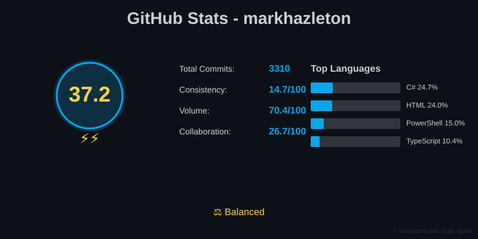
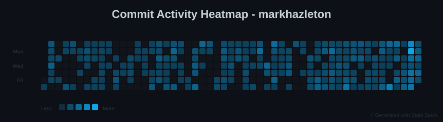
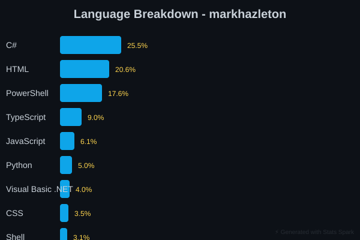
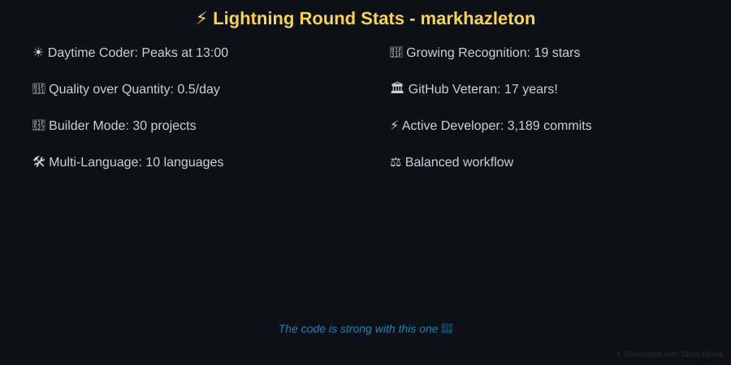

# GitHub Profile: markhazleton

**Generated**: 2026-04-26 01:26:22 UTC
**Report Version**: 1.0.0
**Repositories Analyzed**: 30
**AI Summary Rate**: 0.0%

> 💡 **Navigation**: [Profile Overview](#profile-overview) | [Top Repositories](#top-30-repositories) | [Metadata](#report-metadata)

---

## Profile Overview

### Activity Dashboard

### Commit Activity

### Technology Breakdown

### Release Patterns

---

## Top 30 Repositories

### #1. [devspark](https://github.com/markhazleton/devspark)

Stars: 0 | Forks: 0 | Language: Python | 267 commits (90d)

👥 0 contributors | 🌐 4 languages | 💾 6376 KB | 🚀 89.0 commits/month

**Quality**: ❌ License | ✅ Docs

Built with Python. Actively maintained with regular updates.

**Technology Stack Currency**: ✅ 76/100
**Dependencies**: 5 total (1 current, 4 outdated)

**Created**: 2026-04-02
**Last Modified**: 2026-04-24

---

### #2. [WebSpark.HttpClientUtility](https://github.com/markhazleton/WebSpark.HttpClientUtility)

Stars: 0 | Forks: 0 | Language: C# | 71 commits (90d)

👥 0 contributors | 🌐 7 languages | 💾 2991 KB | 🚀 23.7 commits/month

**Quality**: ❌ License | ✅ Docs

**Drop-in HttpClient wrapper with Polly resilience, response caching, and OpenTelemetry for .NET 8-10 LTS APIs—configured in one line** Built with C#. Actively maintained with regular updates.

**Created**: 2025-05-03
**Last Modified**: 2026-04-23

---

### #3. [TailwindSpark](https://github.com/markhazleton/TailwindSpark)

Stars: 0 | Forks: 0 | Language: TypeScript | 98 commits (90d)

👥 0 contributors | 🌐 7 languages | 💾 3928 KB | 🚀 32.7 commits/month

**Quality**: ❌ License | ✅ Docs

   [

**Created**: 2025-07-29
**Last Modified**: 2026-04-16

---

### #4. [github-stats-spark](https://github.com/markhazleton/github-stats-spark)

Stars: 0 | Forks: 0 | Language: Python | 106 commits (90d)

👥 0 contributors | 🌐 6 languages | 💾 19124 KB | 🚀 35.3 commits/month

**Quality**: ❌ License | ✅ Docs

> Automated GitHub profile statistics generator with beautiful SVG visualizations and AI-powered repository analysis Built with Python. Actively maintained with regular updates.

**Technology Stack Currency**: ✅ 69/100
**Dependencies**: 10 total (1 current, 9 outdated)

**Created**: 2025-12-28
**Last Modified**: 2026-04-24

---

### #5. [UISampleSpark](https://github.com/markhazleton/UISampleSpark)

Stars: 8 | Forks: 4 | Language: HTML | 87 commits (90d)

👥 0 contributors | 🌐 7 languages | 💾 31088 KB | 🚀 29.0 commits/month

**Quality**: ❌ License | ✅ Docs

A .NET 10 (ASP.NET Core) application exploring multiple front-end technologies for building modern web user interfaces. This repository is an educational reference that compares UI patterns — MVC, Razor Pages, React, Vue, htmx, Blazor, and vanilla JavaScript SPA — using a common Employee/Department  Built with HTML. Actively maintained with regular updates.

**Created**: 2019-04-25
**Last Modified**: 2026-04-11

---

### #6. [InquirySpark](https://github.com/markhazleton/InquirySpark)

Stars: 0 | Forks: 0 | Language: C# | 61 commits (90d)

👥 0 contributors | 🌐 10 languages | 💾 13803 KB | 🚀 20.3 commits/month

**Quality**: ❌ License | ✅ Docs

Spark Your Inquiry, Ignite Insights. Built with C#. Actively maintained with regular updates.

**Created**: 2023-10-24
**Last Modified**: 2026-04-18

---

### #7. [git-spark](https://github.com/markhazleton/git-spark)

Stars: 0 | Forks: 0 | Language: PowerShell | 44 commits (90d)

👥 0 contributors | 🌐 6 languages | 💾 1818 KB | 🚀 14.7 commits/month

**Quality**: ❌ License | ✅ Docs

**Analyze commit patterns and contributor activity with interactive reports** Built with PowerShell. Actively maintained with regular updates.

**Technology Stack Currency**: ✅ 92/100
**Dependencies**: 22 total (18 current, 4 outdated)

**Created**: 2025-09-29
**Last Modified**: 2026-04-19

---

### #8. [RequestSpark](https://github.com/markhazleton/RequestSpark)

Stars: 2 | Forks: 1 | Language: C# | 45 commits (90d)

👥 0 contributors | 🌐 5 languages | 💾 947 KB | 🚀 15.0 commits/month

**Quality**: ❌ License | ✅ Docs

  [

Stars: 0 | Forks: 0 | Language: TypeScript | 43 commits (90d)

👥 0 contributors | 🌐 8 languages | 💾 37661 KB | 🚀 14.3 commits/month

**Quality**: ❌ License | ✅ Docs

  [

**Created**: 2024-10-11
**Last Modified**: 2026-04-19

---

### #10. [MuseumSpark](https://github.com/markhazleton/MuseumSpark)

Stars: 0 | Forks: 0 | Language: Python | 24 commits (90d)

👥 0 contributors | 🌐 7 languages | 💾 24113 KB | 🚀 8.0 commits/month

**Quality**: ❌ License | ✅ Docs

> **The strategic travel planner for art lovers.** > Curate, prioritize, and optimize your museum visits across North America. Built with Python. Actively maintained with regular updates.

**Created**: 2026-01-15
**Last Modified**: 2026-04-12

---

### #11. [SupportSpark](https://github.com/markhazleton/SupportSpark)

Stars: 0 | Forks: 0 | Language: PowerShell | 52 commits (90d)

👥 0 contributors | 🌐 6 languages | 💾 1585 KB | 🚀 17.3 commits/month

**Quality**: ❌ License | ❌ Docs

> A compassionate support network platform helping people share updates with their trusted circle during life's challenging moments. Built with PowerShell. Key features: Create and manage journey conversations, Post updates with text and images, Invite trusted supporters via email. Actively maintained with regular updates.

**Technology Stack Currency**: ✅ 50/100
**Dependencies**: 97 total (97 current, 0 outdated)

**Created**: 2026-02-01
**Last Modified**: 2026-04-12

---

### #12. [markhazleton](https://github.com/markhazleton/markhazleton)

Stars: 0 | Forks: 0 | Language: Unknown | 25 commits (90d)

👥 0 contributors | 🌐 1 languages | 💾 6618 KB | 🚀 8.3 commits/month

**Quality**: ❌ License | ❌ Docs

--- Actively maintained with regular updates.

**Created**: 2021-04-17
**Last Modified**: 2026-04-23

---

### #13. [Texecon](https://github.com/markhazleton/Texecon)

Stars: 0 | Forks: 0 | Language: HTML | 32 commits (90d)

👥 0 contributors | 🌐 6 languages | 💾 3917 KB | 🚀 10.7 commits/month

**Quality**: ❌ License | ❌ Docs

A modern static React application providing expert analysis and commentary on the Texas economy. Built with React 19, TypeScript, and Tailwind CSS for optimal performance and SEO on GitHub Pages. Built with HTML. Key features: **Build-time Content Management**: Fresh content from WebSpark API with cached fallbacks, **Static Site Generation**: Pre-rendered pages for optimal SEO and performance, **Progressive Enhancement**: Client-side routing with static HTML fallbacks. Actively maintained with regular updates.

**Technology Stack Currency**: ✅ 50/100
**Dependencies**: 37 total (37 current, 0 outdated)

**Created**: 2025-09-03
**Last Modified**: 2026-04-19

---

### #14. [WebProjectMechanics](https://github.com/markhazleton/WebProjectMechanics)

Stars: 3 | Forks: 0 | Language: Visual Basic .NET | 11 commits (90d)

👥 0 contributors | 🌐 11 languages | 💾 52587 KB | 🚀 3.7 commits/month

**Quality**: ❌ License | ✅ Docs

A multi-tenant, multi-domain content management system that publishes static HTML websites from SQLite databases. Built with Visual Basic .NET. Actively maintained with regular updates.

**Created**: 2017-09-19
**Last Modified**: 2026-04-13

---

### #15. [WebSpark](https://github.com/markhazleton/WebSpark)

Stars: 1 | Forks: 0 | Language: C# | 11 commits (90d)

👥 0 contributors | 🌐 8 languages | 💾 69144 KB | 🚀 3.7 commits/month

**Quality**: ❌ License | ❌ Docs

WebSpark is a suite of web applications built with .NET 9 and Bootstrap 5, designed to optimize LLM prompts, manage recipes, and create quizzes. This repository includes: Built with C#. Key features: **Modern web technologies**: .NET 9, Bootstrap 5, ASP.NET Core MVC, **Scalable and versatile architecture**: 7 modular areas (PromptSpark, RecipeSpark, TriviaSpark, WebCMS, AsyncSpark, Admin, Identity), **Spec-driven development workflow**: Automated risk assessment with SpecKit commands. Actively maintained with regular updates.

**Created**: 2024-01-11
**Last Modified**: 2026-01-29

---

### #16. [KeyPressCounter](https://github.com/markhazleton/KeyPressCounter)

Stars: 2 | Forks: 1 | Language: C# | 6 commits (90d)

👥 0 contributors | 🌐 2 languages | 💾 46596 KB | 🚀 2.0 commits/month

**Quality**: ❌ License | ✅ Docs

    Built with C#. Key features: **Keystroke & Mouse Click Tracking** — counts total inputs since last reset, **Peak Activity Metrics** — tracks maximum keystrokes and clicks per minute, **Inactivity Detection** — measures longest continuous idle period in minutes. Maintained project with periodic updates.

**Technology Stack Currency**: ✅ 57/100
**Dependencies**: 4 total (3 current, 1 outdated)

**Created**: 2024-03-07
**Last Modified**: 2026-03-30

---

### #17. [react-native-web-start](https://github.com/markhazleton/react-native-web-start)

Stars: 0 | Forks: 0 | Language: PowerShell | 22 commits (90d)

👥 0 contributors | 🌐 7 languages | 💾 3104 KB | 🚀 7.3 commits/month

**Quality**: ❌ License | ✅ Docs

  

**Created**: 2025-07-26
**Last Modified**: 2026-04-12

---

### #18. [DataSpark](https://github.com/markhazleton/DataSpark)

Stars: 0 | Forks: 0 | Language: HTML | 13 commits (90d)

👥 0 contributors | 🌐 5 languages | 💾 2075 KB | 🚀 4.3 commits/month

**Quality**: ❌ License | ✅ Docs

  [.. Actively maintained with regular updates.

**Created**: 2017-11-06
**Last Modified**: 2026-04-01

---

### #19. [PromptSpark.Chat](https://github.com/markhazleton/PromptSpark.Chat)

Stars: 0 | Forks: 0 | Language: C# | 21 commits (90d)

👥 0 contributors | 🌐 6 languages | 💾 19307 KB | 🚀 7.0 commits/month

**Quality**: ❌ License | ✅ Docs

**A real-time, conversational workflow application built with ASP.NET Core, SignalR, and Adaptive Cards. It demonstrates how to guide users through multi-step processes, present interactive UI elements, and optionally integrate AI-driven responses—all while providing flexible workflow logic, simple  Built with C#. Key features: **Adaptive Cards** for interactive input, **Real-time Communication** with SignalR, **Workflow Persistence** in memory using a thread-safe store. Actively maintained with regular updates.

**Created**: 2024-12-31
**Last Modified**: 2026-03-30

---

### #20. [markhazleton.github.io](https://github.com/markhazleton/markhazleton.github.io)

Stars: 0 | Forks: 0 | Language: SCSS | 7 commits (90d)

👥 0 contributors | 🌐 5 languages | 💾 161 KB | 🚀 2.3 commits/month

**Quality**: ❌ License | ✅ Docs

   Built with SCSS. Maintained project with periodic updates.

**Technology Stack Currency**: ✅ 56/100
**Dependencies**: 3 total (2 current, 1 outdated)

**Created**: 2021-04-18
**Last Modified**: 2026-04-01

---

### #21. [PHPDocSpark](https://github.com/markhazleton/PHPDocSpark)

Stars: 0 | Forks: 0 | Language: PHP | 6 commits (90d)

👥 0 contributors | 🌐 8 languages | 💾 2935 KB | 🚀 2.0 commits/month

**Quality**: ❌ License | ✅ Docs

  Built with PHP. Maintained project with periodic updates.

**Technology Stack Currency**: ✅ 50/100
**Dependencies**: 27 total (27 current, 0 outdated)

**Created**: 2023-09-08
**Last Modified**: 2026-03-30

---

### #22. [TeachSpark](https://github.com/markhazleton/TeachSpark)

Stars: 0 | Forks: 0 | Language: C# | 12 commits (90d)

👥 0 contributors | 🌐 7 languages | 💾 29927 KB | 🚀 4.0 commits/month

**Quality**: ❌ License | ✅ Docs

   [

Stars: 0 | Forks: 0 | Language: C# | 9 commits (90d)

👥 0 contributors | 🌐 7 languages | 💾 1925 KB | 🚀 3.0 commits/month

**Quality**: ❌ License | ✅ Docs

Production-ready reference implementation for async/await patterns in .NET 10 with constitution-driven development practices. Built with C#. Maintained project with periodic updates.

**Created**: 2022-08-07
**Last Modified**: 2026-02-10

---

### #24. [FastEndpointApi](https://github.com/markhazleton/FastEndpointApi)

Stars: 3 | Forks: 1 | Language: HTML | 0 commits (90d)

👥 0 contributors | 🌐 4 languages | 💾 137 KB | 🚀 0 commits/month

**Quality**: ❌ License | ✅ Docs

  [

Stars: 0 | Forks: 0 | Language: Python | 6 commits (90d)

👥 0 contributors | 🌐 4 languages | 💾 216 KB | 🚀 2.0 commits/month

**Quality**: ❌ License | ✅ Docs

DocSpark is a document AI tool derived from DevSpark. Built with Python. Maintained project with periodic updates.

**Technology Stack Currency**: ✅ 50/100
**Dependencies**: 2 total (0 current, 2 outdated)

**Created**: 2026-03-07
**Last Modified**: 2026-04-03

---

### #26. [MechanicsOfMotherhood](https://github.com/markhazleton/MechanicsOfMotherhood)

Stars: 0 | Forks: 0 | Language: TypeScript | 9 commits (90d)

👥 0 contributors | 🌐 6 languages | 💾 6719 KB | 🚀 3.0 commits/month

**Quality**: ❌ License | ✅ Docs

**A modern recipe management platform designed for busy working mothers** Built with TypeScript. Maintained project with periodic updates.

**Technology Stack Currency**: ✅ 50/100
**Dependencies**: 42 total (42 current, 0 outdated)

**Created**: 2025-09-01
**Last Modified**: 2026-03-09

---

### #27. [WebSpark.PrismSpark](https://github.com/markhazleton/WebSpark.PrismSpark)

Stars: 0 | Forks: 0 | Language: C# | 8 commits (90d)

👥 0 contributors | 🌐 6 languages | 💾 2272 KB | 🚀 2.7 commits/month

**Quality**: ❌ License | ✅ Docs

A modern, high-performance C#/.NET port of [PrismJS](https://github.com/PrismJS/prism) for advanced syntax highlighting, theming, and extensibility. Built with C#. Key features: **Tokenization & Highlighting** for 24 languages (C#, JavaScript, Python, Markdown, Pug, and more), **Plugin System**: Line numbers, copy-to-clipboard, toolbar, and more, **Theme System**: Built-in and custom themes, CSS generation. Maintained project with periodic updates.

**Created**: 2025-05-27
**Last Modified**: 2026-02-11

---

### #28. [WebSpark.ArtSpark](https://github.com/markhazleton/WebSpark.ArtSpark)

Stars: 0 | Forks: 0 | Language: C# | 0 commits (90d)

👥 0 contributors | 🌐 6 languages | 💾 3658 KB | 🚀 0 commits/month

**Quality**: ❌ License | ✅ Docs

**A comprehensive .NET solution for the Art Institute of Chicago's public API, featuring a complete client library, revolutionary AI chat system with multiple personas, and demo applications showcasing modern .NET development practices.** Built with C#. Key features: ✅ **Complete API Coverage**: All 33 endpoints across 6 categories, ✅ **Strongly Typed Models**: Comprehensive C# models for all resource types, ✅ **Async/Await Support**: Modern asynchronous programming patterns. Maintained project with periodic updates.

**Created**: 2023-01-30
**Last Modified**: 2026-01-12

---

### #29. [WebSpark.Bootswatch](https://github.com/markhazleton/WebSpark.Bootswatch)

Stars: 0 | Forks: 0 | Language: HTML | 0 commits (90d)

👥 0 contributors | 🌐 6 languages | 💾 7124 KB | 🚀 0 commits/month

**Quality**: ❌ License | ✅ Docs

A .NET Razor Class Library that provides seamless integration of [Bootswatch](https://bootswatch.com/) themes into ASP.NET Core applications. Built on Bootstrap 5, this library offers modern, responsive theming with dynamic theme switching, light/dark mode support, and comprehensive caching mechanis Built with HTML. Maintained project with periodic updates.

**Created**: 2022-08-24
**Last Modified**: 2026-01-12

---

### #30. [TriviaSpark](https://github.com/markhazleton/TriviaSpark)

Stars: 0 | Forks: 0 | Language: C# | 0 commits (90d)

👥 0 contributors | 🌐 5 languages | 💾 27238 KB | 🚀 0 commits/month

**Quality**: ❌ License | ✅ Docs

**This application was developed with the assistance of Chat GPT** Built with C#. Key features: User Registration, Question Database Review (Admin), Leaderboard. Maintained project with periodic updates.

**Created**: 2023-02-22
**Last Modified**: 2025-12-02

---

---

## Report Metadata

- **Generation Time**: 6.1 seconds
- **SVGs Generated**: 6/6
- **Total API Calls**: 0
- **Total AI Tokens**: 0
- **Success Rate**: 100.0%

### Data Sources

- GitHub API (public repositories only)
- Anthropic Claude API (repository summaries)
- Dependency package registries (npm, PyPI, RubyGems, Go, Maven, NuGet)

### Report Details

- **Composite Score Weights**: Popularity 30% • Activity 45% • Health 25%
- **Technology Currency**: Calculated from latest versions in package registries
- **AI Model**: claude-haiku-4-5

---

*Generated by [Stats Spark](https://github.com/markhazleton/github-stats-spark)*
*Last updated: 2026-04-26*