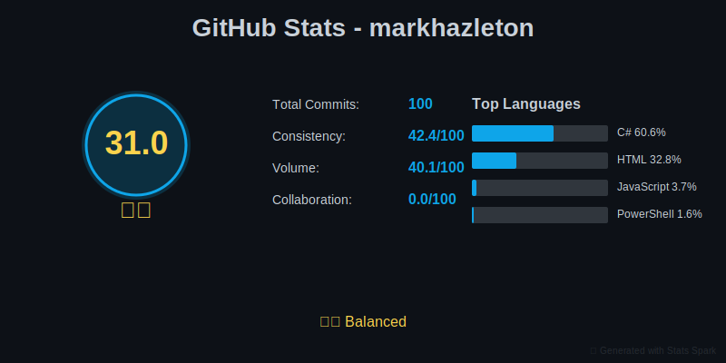
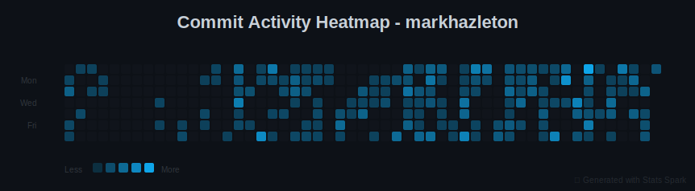
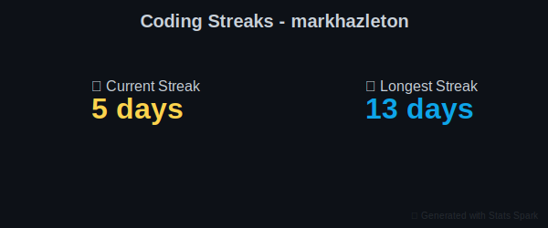
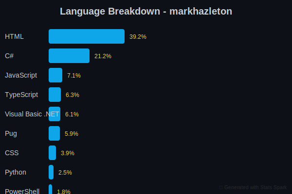
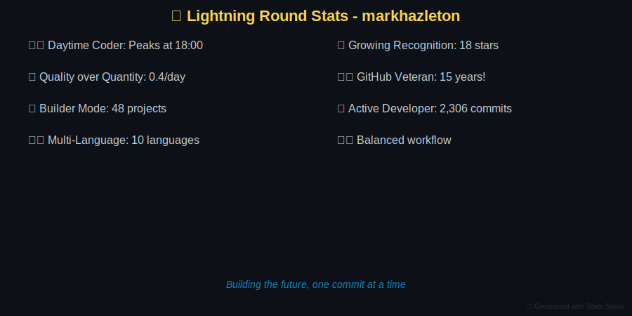
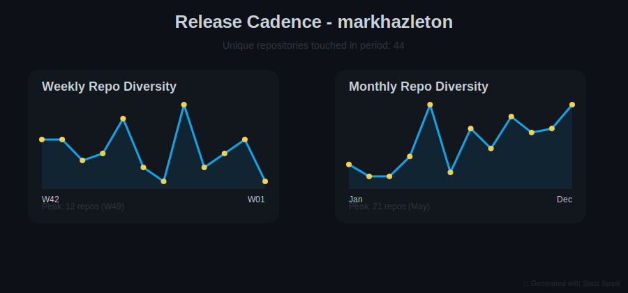

# GitHub Profile: markhazleton

**Generated**: 2026-01-09 06:01:58 UTC
**Report Version**: 1.0.0
**Repositories Analyzed**: 45
**AI Summary Rate**: 0.0%

> 💡 **Navigation**: [Profile Overview](#profile-overview) | [Top Repositories](#top-45-repositories) | [Metadata](#report-metadata)

---

## Profile Overview

### Activity Dashboard

### Commit Activity

### Technology Breakdown

### Release Patterns

---

## Top 45 Repositories

### #1. [github-stats-spark](https://github.com/markhazleton/github-stats-spark)

Stars: 0 | Forks: 0 | Language: Python | 92 commits (90d)

👥 0 contributors | 🌐 6 languages | 💾 7335 KB | 🚀 30.7 commits/month

**Quality**: ❌ License | ✅ Docs

> Automated GitHub profile statistics generator with beautiful SVG visualizations and AI-powered repository analysis Built with Python. Actively maintained with regular updates.

**Technology Stack Currency**: ✅ 50/100
**Dependencies**: 9 total (9 current, 0 outdated)

**Created**: 2025-12-28
**Last Modified**: 2026-01-07

---

### #2. [WebSpark.HttpClientUtility](https://github.com/markhazleton/WebSpark.HttpClientUtility)

Stars: 0 | Forks: 0 | Language: C# | 71 commits (90d)

👥 0 contributors | 🌐 6 languages | 💾 2157 KB | 🚀 23.7 commits/month

**Quality**: ❌ License | ✅ Docs

**Drop-in HttpClient wrapper with Polly resilience, response caching, and OpenTelemetry for .NET 8-10+ APIs—configured in one line** Built with C#. Actively maintained with regular updates.

**Created**: 2025-05-03
**Last Modified**: 2026-01-05

---

### #3. [git-spark](https://github.com/markhazleton/git-spark)

Stars: 0 | Forks: 0 | Language: TypeScript | 56 commits (90d)

👥 0 contributors | 🌐 5 languages | 💾 1282 KB | 🚀 18.7 commits/month

**Quality**: ❌ License | ✅ Docs

**Analyze commit patterns and contributor activity with interactive reports** Built with TypeScript. Key features: **Pull Request Analytics**: Comprehensive PR workflow analysis including cycle times, review metrics, **Work Item Tracking**: Link PRs to work items and requirements, **Review Metrics**: Review efficiency and collaboration patterns. Actively maintained with regular updates.

**Technology Stack Currency**: ✅ 50/100
**Dependencies**: 19 total (19 current, 0 outdated)

**Created**: 2025-09-29
**Last Modified**: 2025-12-29

---

### #4. [markhazleton-blog](https://github.com/markhazleton/markhazleton-blog)

Stars: 1 | Forks: 1 | Language: Pug | 80 commits (90d)

👥 0 contributors | 🌐 9 languages | 💾 121228 KB | 🚀 26.7 commits/month

**Quality**: ❌ License | ❌ Docs

[Mark Hazleton Blog](https://markhazleton.com/) is Mark Hazleton's professional blog and portfolio site featuring articles on project management, web development, and technology solutions. Built with a modern static site generation system using PUG templates, Bootstrap 5, and a unified Node.js build Built with Pug. Actively maintained with regular updates.

**Technology Stack Currency**: ✅ 50/100
**Dependencies**: 26 total (26 current, 0 outdated)

**Created**: 2023-07-28
**Last Modified**: 2026-01-06

---

### #5. [SampleMvcCRUD](https://github.com/markhazleton/SampleMvcCRUD)

Stars: 8 | Forks: 4 | Language: HTML | 14 commits (90d)

👥 0 contributors | 🌐 5 languages | 💾 29938 KB | 🚀 4.7 commits/month

**Quality**: ❌ License | ✅ Docs

A .NET 10 (ASP.NET Core) application demonstrating multiple approaches to implementing a modern, maintainable CRUD (Create, Read, Update, Delete) user interface for Employee and Department management. This repository is a reference and educational resource that showcases patterns (MVC, Razor Pages,  Built with HTML. Actively maintained with regular updates.

**Created**: 2019-04-25
**Last Modified**: 2026-01-05

---

### #6. [tailwind-demo](https://github.com/markhazleton/tailwind-demo)

Stars: 0 | Forks: 0 | Language: HTML | 24 commits (90d)

👥 0 contributors | 🌐 6 languages | 💾 1378 KB | 🚀 8.0 commits/month

**Quality**: ❌ License | ✅ Docs

   [

**Created**: 2025-07-29
**Last Modified**: 2026-01-05

---

### #7. [RESTRunner](https://github.com/markhazleton/RESTRunner)

Stars: 2 | Forks: 1 | Language: C# | 15 commits (90d)

👥 0 contributors | 🌐 3 languages | 💾 411 KB | 🚀 5.0 commits/month

**Quality**: ❌ License | ✅ Docs

  [

Stars: 1 | Forks: 0 | Language: C# | 18 commits (90d)

👥 0 contributors | 🌐 7 languages | 💾 68664 KB | 🚀 6.0 commits/month

**Quality**: ❌ License | ❌ Docs

WebSpark is a suite of web applications built with .NET 9 and Bootstrap 5, designed to optimize LLM prompts, manage recipes, and create quizzes. This repository includes: Built with C#. Key features: **Modern web technologies**: .NET 9, Bootstrap 5, ASP.NET Core MVC, **Scalable and versatile architecture**: 8 modular areas (PromptSpark, RecipeSpark, TriviaSpark, WebCMS, GitHubSpark, AsyncSpark, Admin, Identity), **Spec-driven development workflow**: Automated risk assessment with SpecKit commands. Actively maintained with regular updates.

**Created**: 2024-01-11
**Last Modified**: 2025-12-27

---

### #9. [js-dev-env](https://github.com/markhazleton/js-dev-env)

Stars: 0 | Forks: 0 | Language: JavaScript | 20 commits (90d)

👥 0 contributors | 🌐 5 languages | 💾 3001 KB | 🚀 6.7 commits/month

**Quality**: ❌ License | ✅ Docs

 

**Created**: 2022-06-06
**Last Modified**: 2026-01-05

---

### #10. [react-native-web-start](https://github.com/markhazleton/react-native-web-start)

Stars: 0 | Forks: 0 | Language: TypeScript | 20 commits (90d)

👥 0 contributors | 🌐 5 languages | 💾 2813 KB | 🚀 6.7 commits/month

**Quality**: ❌ License | ✅ Docs

  

**Created**: 2025-07-26
**Last Modified**: 2025-10-21

---

### #11. [Texecon](https://github.com/markhazleton/Texecon)

Stars: 0 | Forks: 0 | Language: HTML | 15 commits (90d)

👥 0 contributors | 🌐 4 languages | 💾 2984 KB | 🚀 5.0 commits/month

**Quality**: ❌ License | ❌ Docs

A modern static React application providing expert analysis and commentary on the Texas economy. Built with React 19, TypeScript, and Tailwind CSS for optimal performance and SEO on GitHub Pages. Built with HTML. Key features: **Build-time Content Management**: Fresh content from WebSpark API with cached fallbacks, **Static Site Generation**: Pre-rendered pages for optimal SEO and performance, **Progressive Enhancement**: Client-side routing with static HTML fallbacks. Actively maintained with regular updates.

**Technology Stack Currency**: ✅ 50/100
**Dependencies**: 50 total (50 current, 0 outdated)

**Created**: 2025-09-03
**Last Modified**: 2026-01-04

---

### #12. [WebSpark.ArtSpark](https://github.com/markhazleton/WebSpark.ArtSpark)

Stars: 0 | Forks: 0 | Language: C# | 30 commits (90d)

👥 0 contributors | 🌐 5 languages | 💾 3655 KB | 🚀 10.0 commits/month

**Quality**: ❌ License | ✅ Docs

**A comprehensive .NET solution for the Art Institute of Chicago's public API, featuring a complete client library, revolutionary AI chat system with multiple personas, and demo applications showcasing modern .NET development practices.** Built with C#. Key features: ✅ **Complete API Coverage**: All 33 endpoints across 6 categories, ✅ **Strongly Typed Models**: Comprehensive C# models for all resource types, ✅ **Async/Await Support**: Modern asynchronous programming patterns. Actively maintained with regular updates.

**Created**: 2023-01-30
**Last Modified**: 2025-12-28

---

### #13. [MechanicsOfMotherhood](https://github.com/markhazleton/MechanicsOfMotherhood)

Stars: 0 | Forks: 0 | Language: TypeScript | 2 commits (90d)

👥 0 contributors | 🌐 4 languages | 💾 4809 KB | 🚀 0.7 commits/month

**Quality**: ❌ License | ✅ Docs

**A modern recipe management platform designed for busy working mothers** Built with TypeScript. Maintained project with periodic updates.

**Technology Stack Currency**: ✅ 50/100
**Dependencies**: 38 total (38 current, 0 outdated)

**Created**: 2025-09-01
**Last Modified**: 2026-01-04

---

### #14. [Slurper](https://github.com/markhazleton/Slurper)

Stars: 0 | Forks: 0 | Language: C# | 12 commits (90d)

👥 0 contributors | 🌐 6 languages | 💾 4134 KB | 🚀 4.0 commits/month

**Quality**: ❌ License | ❌ Docs

  Built with C#. Actively maintained with regular updates.

**Technology Stack Currency**: ✅ 50/100
**Dependencies**: 1 total (1 current, 0 outdated)

**Created**: 2023-03-24
**Last Modified**: 2025-11-16

---

### #15. [ReactSparkPortfolio](https://github.com/markhazleton/ReactSparkPortfolio)

Stars: 0 | Forks: 0 | Language: CSS | 10 commits (90d)

👥 0 contributors | 🌐 5 languages | 💾 44254 KB | 🚀 3.3 commits/month

**Quality**: ❌ License | ✅ Docs

  [

Stars: 0 | Forks: 0 | Language: C# | 1 commits (90d)

👥 0 contributors | 🌐 5 languages | 💾 6182 KB | 🚀 0.3 commits/month

**Quality**: ❌ License | ✅ Docs

* ✅ Typed responses and requests to over 74 endpoints. Complete and always up to date. * ✅ Supports `.NET Standard 2.X`, which includes all major platforms, including mobile: * `.NET Framework` * `UWP` * `.NET Core` * `Xamarin.Forms` * ✅ Included `HTTPClient`, but feel free to bring your own! * ✅ Lo Built with C#. Key features: ✅ Typed responses and requests to over 74 endpoints. Complete and always up to date., ✅ Supports `.NET Standard 2.X`, which includes all major platforms, including mobile:, `.NET Framework`. Maintained project with periodic updates.

**Created**: 2022-10-25
**Last Modified**: 2026-01-03

---

### #17. [KeyPressCounter](https://github.com/markhazleton/KeyPressCounter)

Stars: 1 | Forks: 1 | Language: C# | 13 commits (90d)

👥 0 contributors | 🌐 1 languages | 💾 46573 KB | 🚀 4.3 commits/month

**Quality**: ❌ License | ✅ Docs

   Built with C#. Actively maintained with regular updates.

**Technology Stack Currency**: ✅ 50/100
**Dependencies**: 4 total (4 current, 0 outdated)

**Created**: 2024-03-07
**Last Modified**: 2025-12-07

---

### #18. [FastEndpointApi](https://github.com/markhazleton/FastEndpointApi)

Stars: 2 | Forks: 1 | Language: HTML | 6 commits (90d)

👥 0 contributors | 🌐 3 languages | 💾 127 KB | 🚀 2.0 commits/month

**Quality**: ❌ License | ✅ Docs

 Built with HTML. Maintained project with periodic updates.

**Created**: 2024-04-06
**Last Modified**: 2025-11-16

---

### #19. [ConcurrentProcessing](https://github.com/markhazleton/ConcurrentProcessing)

Stars: 0 | Forks: 0 | Language: C# | 19 commits (90d)

👥 0 contributors | 🌐 1 languages | 💾 126 KB | 🚀 6.3 commits/month

**Quality**: ❌ License | ✅ Docs

 [

**Created**: 2023-09-18
**Last Modified**: 2025-12-18

---

### #20. [SolidSample](https://github.com/markhazleton/SolidSample)

Stars: 0 | Forks: 0 | Language: C# | 3 commits (90d)

👥 0 contributors | 🌐 4 languages | 💾 1453 KB | 🚀 1.0 commits/month

**Quality**: ❌ License | ❌ Docs

A sample application used to demonstrate SOLID principles for the Pluralsight course, [SOLID Principles for C# Developers](https://app.pluralsight.com/library/courses/csharp-solid-principles). Built with C#. Maintained project with periodic updates.

**Created**: 2020-07-02
**Last Modified**: 2026-01-05

---

### #21. [RazorPages](https://github.com/markhazleton/RazorPages)

Stars: 0 | Forks: 0 | Language: JavaScript | 3 commits (90d)

👥 0 contributors | 🌐 6 languages | 💾 19351 KB | 🚀 1.0 commits/month

**Quality**: ❌ License | ❌ Docs

Welcome to the **Wired Brain Coffee** solution! This repository demonstrates a modern, full-stack .NET application using Razor Pages, Blazor WebAssembly, ASP.NET Core APIs, and Minimal APIs. It is designed as a reference for best practices in architecture, code organization, and developer experience Built with JavaScript. Maintained project with periodic updates.

**Created**: 2020-03-29
**Last Modified**: 2026-01-02

---

### #22. [InquirySpark](https://github.com/markhazleton/InquirySpark)

Stars: 0 | Forks: 0 | Language: C# | 18 commits (90d)

👥 0 contributors | 🌐 6 languages | 💾 9371 KB | 🚀 6.0 commits/month

**Quality**: ❌ License | ✅ Docs

Spark Your Inquiry, Ignite Insights. Built with C#. Actively maintained with regular updates.

**Created**: 2023-10-24
**Last Modified**: 2025-12-07

---

### #23. [markhazleton](https://github.com/markhazleton/markhazleton)

Stars: 0 | Forks: 0 | Language: Unknown | 4 commits (90d)

👥 0 contributors | 🌐 1 languages | 💾 6583 KB | 🚀 1.3 commits/month

**Quality**: ❌ License | ❌ Docs

> My repositories serve as a dynamic archive of my learning journey, each one a milestone in my continuous pursuit of knowledge and mastery in technology. From structured explorations in new (to me) technologies to experimental projects that push the boundaries of my understanding, these collections Maintained project with periodic updates.

**Created**: 2021-04-17
**Last Modified**: 2025-12-28

---

### #24. [WebSpark.PrismSpark](https://github.com/markhazleton/WebSpark.PrismSpark)

Stars: 0 | Forks: 0 | Language: HTML | 6 commits (90d)

👥 0 contributors | 🌐 4 languages | 💾 2090 KB | 🚀 2.0 commits/month

**Quality**: ❌ License | ✅ Docs

A modern, high-performance C#/.NET port of [PrismJS](https://github.com/PrismJS/prism) for advanced syntax highlighting, theming, and extensibility. Built with HTML. Key features: **Tokenization & Highlighting** for 20+ languages, **Plugin System**: Line numbers, copy-to-clipboard, toolbar, and more, **Theme System**: Built-in and custom themes, CSS generation. Maintained project with periodic updates.

**Created**: 2025-05-27
**Last Modified**: 2026-01-05

---

### #25. [DecisionSpark](https://github.com/markhazleton/DecisionSpark)

Stars: 0 | Forks: 0 | Language: C# | 18 commits (90d)

👥 0 contributors | 🌐 4 languages | 💾 519 KB | 🚀 6.0 commits/month

**Quality**: ❌ License | ✅ Docs

   [

Stars: 3 | Forks: 0 | Language: Visual Basic .NET | 0 commits (90d)

👥 0 contributors | 🌐 9 languages | 💾 53211 KB | 🚀 0 commits/month

**Quality**: ❌ License | ✅ Docs

Web Project Mechanics is a powerful web content management system developed by Mark Hazleton over the past 20+ years. This system has been designed to provide users with the ability to manage multiple websites using a single MS-Access (.mdb) database. Built with Visual Basic .NET. Maintained project with periodic updates.

**Created**: 2017-09-19
**Last Modified**: 2025-02-26

---

### #27. [DesignPatternsInCSharp](https://github.com/markhazleton/DesignPatternsInCSharp)

Stars: 0 | Forks: 0 | Language: HTML | 4 commits (90d)

👥 0 contributors | 🌐 2 languages | 💾 246 KB | 🚀 1.3 commits/month

**Quality**: ❌ License | ✅ Docs

Some sample implementations of design patterns in C#. Built with HTML. Maintained project with periodic updates.

**Created**: 2021-02-03
**Last Modified**: 2026-01-05

---

### #28. [csharp-blazor-bug-tracking](https://github.com/markhazleton/csharp-blazor-bug-tracking)

Stars: 0 | Forks: 0 | Language: C# | 4 commits (90d)

👥 0 contributors | 🌐 6 languages | 💾 1589 KB | 🚀 1.3 commits/month

**Quality**: ❌ License | ✅ Docs

* Install the [.NET SDK](https://dotnet.microsoft.com/en-us/download) * Have an IDE installed - the three main options are: * [VS Code](https://code.visualstudio.com/) - include the [C# language extension](https://marketplace.visualstudio.com/items?itemName=ms-dotnettools.csharp) * [Visual Studio or Built with C#. Maintained project with periodic updates.

**Created**: 2022-06-08
**Last Modified**: 2025-12-29

---

### #29. [WebSpark.Bootswatch](https://github.com/markhazleton/WebSpark.Bootswatch)

Stars: 0 | Forks: 0 | Language: HTML | 14 commits (90d)

👥 0 contributors | 🌐 5 languages | 💾 7093 KB | 🚀 4.7 commits/month

**Quality**: ❌ License | ✅ Docs

A .NET Razor Class Library that provides seamless integration of [Bootswatch](https://bootswatch.com/) themes into ASP.NET Core applications. Built on Bootstrap 5, this library offers modern, responsive theming with dynamic theme switching, light/dark mode support, and comprehensive caching mechanis Built with HTML. Actively maintained with regular updates.

**Created**: 2022-08-24
**Last Modified**: 2025-12-04

---

### #30. [AsyncDemo](https://github.com/markhazleton/AsyncDemo)

Stars: 0 | Forks: 0 | Language: C# | 15 commits (90d)

👥 0 contributors | 🌐 6 languages | 💾 1555 KB | 🚀 5.0 commits/month

**Quality**: ❌ License | ✅ Docs

Various demos, tips and tricks for using async in C# Built with C#. Key features: **[?] Modern API Documentation** - Beautiful, interactive API docs using Scalar, **[>] Async Programming Patterns** - Real-world examples of async/await best practices, **[!] Resilience with Polly** - Retry policies, circuit breakers, and fallback strategies. Actively maintained with regular updates.

**Created**: 2022-08-07
**Last Modified**: 2025-12-04

---

### #31. [TeachSpark](https://github.com/markhazleton/TeachSpark)

Stars: 0 | Forks: 0 | Language: C# | 0 commits (90d)

👥 0 contributors | 🌐 6 languages | 💾 30260 KB | 🚀 0 commits/month

**Quality**: ❌ License | ✅ Docs

   [

Stars: 0 | Forks: 0 | Language: C# | 11 commits (90d)

👥 0 contributors | 🌐 3 languages | 💾 1008 KB | 🚀 3.7 commits/month

**Quality**: ❌ License | ✅ Docs

  [ Built with C#. Actively maintained with regular updates.

**Created**: 2023-11-09
**Last Modified**: 2025-12-08

---

### #33. [markhazleton.github.io](https://github.com/markhazleton/markhazleton.github.io)

Stars: 0 | Forks: 0 | Language: SCSS | 4 commits (90d)

👥 0 contributors | 🌐 4 languages | 💾 190 KB | 🚀 1.3 commits/month

**Quality**: ❌ License | ✅ Docs

  [! Built with SCSS. Maintained project with periodic updates.

**Technology Stack Currency**: ✅ 50/100
**Dependencies**: 3 total (3 current, 0 outdated)

**Created**: 2021-04-18
**Last Modified**: 2025-11-03

---

### #34. [sql2csv](https://github.com/markhazleton/sql2csv)

Stars: 0 | Forks: 0 | Language: C# | 0 commits (90d)

👥 0 contributors | 🌐 6 languages | 💾 1868 KB | 🚀 0 commits/month

**Quality**: ❌ License | ✅ Docs

  

Stars: 0 | Forks: 0 | Language: C# | 4 commits (90d)

👥 0 contributors | 🌐 4 languages | 💾 27238 KB | 🚀 1.3 commits/month

**Quality**: ❌ License | ✅ Docs

**This application was developed with the assistance of Chat GPT** Built with C#. Key features: User Registration, Question Database Review (Admin), Leaderboard. Maintained project with periodic updates.

**Created**: 2023-02-22
**Last Modified**: 2025-12-02

---

### #36. [barcodelib](https://github.com/markhazleton/barcodelib)

Stars: 0 | Forks: 0 | Language: JavaScript | 1 commits (90d)

👥 0 contributors | 🌐 8 languages | 💾 53609 KB | 🚀 0.3 commits/month

**Quality**: ❌ License | ✅ Docs

This library was designed to give an easy class for developers to use when they need to generate barcode images from a string of data. Built with JavaScript. Maintained project with periodic updates.

**Created**: 2019-06-20
**Last Modified**: 2025-12-09

---

### #37. [DataAnalysisDemo](https://github.com/markhazleton/DataAnalysisDemo)

Stars: 0 | Forks: 0 | Language: Visual Basic .NET | 1 commits (90d)

👥 0 contributors | 🌐 7 languages | 💾 12926 KB | 🚀 0.3 commits/month

**Quality**: ❌ License | ✅ Docs

  [

**Created**: 2023-04-20
**Last Modified**: 2025-12-03

---

### #38. [PHPDocSpark](https://github.com/markhazleton/PHPDocSpark)

Stars: 0 | Forks: 0 | Language: PHP | 0 commits (90d)

👥 0 contributors | 🌐 7 languages | 💾 2727 KB | 🚀 0 commits/month

**Quality**: ❌ License | ✅ Docs

  Built with PHP. Maintained project with periodic updates.

**Technology Stack Currency**: ✅ 50/100
**Dependencies**: 27 total (27 current, 0 outdated)

**Created**: 2023-09-08
**Last Modified**: 2025-08-18

---

### #39. [google-maps](https://github.com/markhazleton/google-maps)

Stars: 0 | Forks: 0 | Language: C# | 0 commits (90d)

👥 0 contributors | 🌐 2 languages | 💾 2230 KB | 🚀 0 commits/month

**Quality**: ❌ License | ✅ Docs

This project is a fork of the original Google Maps Web Services API wrapper for .NET (https://github.com/maximn/google-maps), extended to include a minimal API using Fast Endpoints and a refactor of the `HttpClient` usage. By introducing a standalone project named `HttpClientUtility`, we've employed Built with C#. Maintained project with periodic updates.

**Created**: 2024-03-28
**Last Modified**: 2025-05-04

---

### #40. [HttpClientDecoratorPattern](https://github.com/markhazleton/HttpClientDecoratorPattern)

Stars: 0 | Forks: 0 | Language: HTML | 0 commits (90d)

👥 0 contributors | 🌐 4 languages | 💾 2665 KB | 🚀 0 commits/month

**Quality**: ❌ License | ✅ Docs

Stars: 0 | Forks: 0 | Language: Unknown | 0 commits (90d)

👥 0 contributors | 🌐 1 languages | 💾 16923 KB | 🚀 0 commits/month

**Quality**: ❌ License | ✅ Docs

  Maintained project with periodic updates.

**Created**: 2025-03-16
**Last Modified**: 2025-03-16

---

### #42. [PromptSpark.Chat](https://github.com/markhazleton/PromptSpark.Chat)

Stars: 0 | Forks: 0 | Language: C# | 0 commits (90d)

👥 0 contributors | 🌐 5 languages | 💾 18717 KB | 🚀 0 commits/month

**Quality**: ❌ License | ✅ Docs

**A real-time, conversational workflow application built with ASP.NET Core, SignalR, and Adaptive Cards. It demonstrates how to guide users through multi-step processes, present interactive UI elements, and optionally integrate AI-driven responses—all while providing flexible workflow logic, simple  Built with C#. Key features: **Adaptive Cards** for interactive input, **Real-time Communication** with SignalR, **Workflow Persistence** in memory using a thread-safe store. Maintained project with periodic updates.

**Created**: 2024-12-31
**Last Modified**: 2025-04-27

---

### #43. [startbootstrap-modern-business](https://github.com/markhazleton/startbootstrap-modern-business)

Stars: 0 | Forks: 0 | Language: Pug | 0 commits (90d)

👥 0 contributors | 🌐 3 languages | 💾 6268 KB | 🚀 0 commits/month

**Quality**: ❌ License | ✅ Docs

A world-class demonstration site for small businesses, built and maintained by [Mark Hazleton](https://markhazleton.com), showcasing the best of Bootstrap 5, Pug, and Node.js build automation. Built with Pug. Key features: Responsive, mobile-first design with Bootstrap 5, Light/Dark mode toggle (Bootstrap 5 best practices), Interactive Theme Customizer (live color, font, border radius, exportable CSS). Maintained project with periodic updates.

**Technology Stack Currency**: ✅ 50/100
**Dependencies**: 18 total (18 current, 0 outdated)

**Created**: 2020-07-08
**Last Modified**: 2025-05-13

---

### #44. [WebSpark.SharedKernel](https://github.com/markhazleton/WebSpark.SharedKernel)

Stars: 0 | Forks: 0 | Language: C# | 0 commits (90d)

👥 0 contributors | 🌐 1 languages | 💾 91 KB | 🚀 0 commits/month

**Quality**: ❌ License | ✅ Docs

  [

Stars: 0 | Forks: 0 | Language: C# | 0 commits (90d)

👥 0 contributors | 🌐 5 languages | 💾 442 KB | 🚀 0 commits/month

**Quality**: ❌ License | ❌ Docs

C# Class Library for Yelp (v3) Fusion API works with .NET projects using Net 6. Yelp's (v3) Fusion API allows you to get the best local business information and user reviews of over million businesses in 32 countries. Built with C#. Maintained project with periodic updates.

**Created**: 2022-08-10
**Last Modified**: 2025-05-04

---

---

## Report Metadata

- **Generation Time**: 0.1 seconds
- **SVGs Generated**: 6/6
- **Total API Calls**: 0
- **Total AI Tokens**: 0
- **Success Rate**: 100.0%

### Data Sources

- GitHub API (public repositories only)
- Anthropic Claude API (repository summaries)
- Dependency package registries (npm, PyPI, RubyGems, Go, Maven, NuGet)

### Report Details

- **Composite Score Weights**: Popularity 30% • Activity 45% • Health 25%
- **Technology Currency**: Calculated from latest versions in package registries
- **AI Model**: claude-3-5-haiku-20241022

---

*Generated by [Stats Spark](https://github.com/markhazleton/github-stats-spark)*
*Last updated: 2026-01-09*